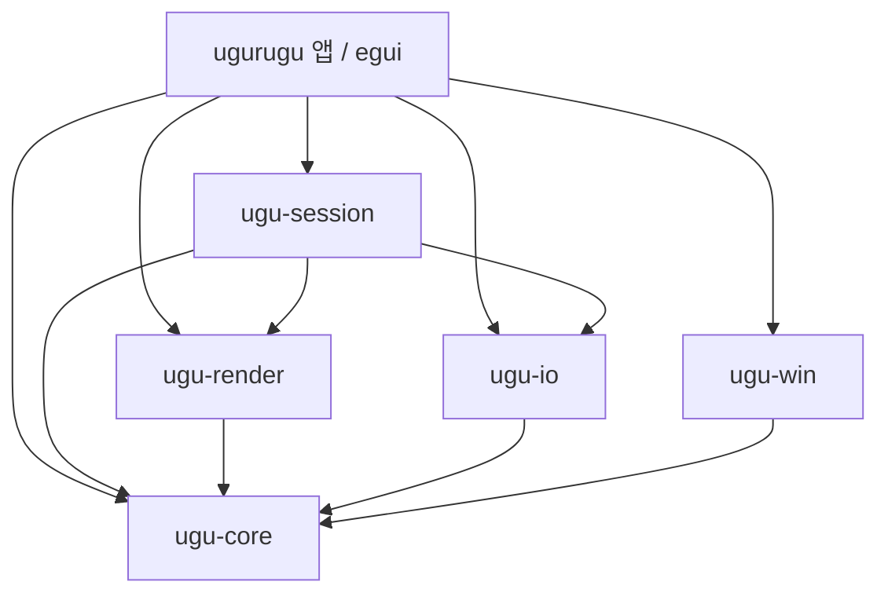

# Ugurugu Rust / Windows 전면 재작성 계획

작성·외부 자료 확인: **2026-10-06, Asia/Seoul**

분석 기준: **2.2.13 · `bfe80eb68c4abef0d8a5bb1b58124a8eda2bebe9`**

검토: **2026-10-06**, 소스 수치·외부 버전 재대조 후 wgpu backend 선택·CTest 설명 정정, 기능표·의존 그래프·현재 앱 기준선·M0 일정 보완

상태: **소스 분석 및 기술 조사에 근거한 제안. Rust 구현·Windows 실측은 아직 수행하지 않음.**

## 1. 권고와 범위

**기존 C++ 엔진을 감싸는 방식 없이, Windows 데스크톱용 Rust 애플리케이션으로 재작성한다.** 제품의 핵심인 필압 드로잉과 우글거림, 편집·저장·내보내기를 새 모델로 구현한다. 기존 구현의 픽셀 결과·파일·설정·ABI 호환성은 유지하지 않는다.

출발점으로 **egui + winit + wgpu + windows-rs**, CPU 기준 렌더러로 **tiny-skia**, 새 문서 컨테이너로 **ZIP + JSON manifest + binary assets**를 권고한다. UI·펜·렌더 조합은 첫 2~3주(M0) 실증을 통과한 뒤 확정한다. GPU는 처음부터 캔버스 표시를 맡고, 브러시와 합성 가속 범위는 실제 병목에 따라 정한다.

| 구분 | 결정 / 계획의 전제 |
|---|---|
| 사용자 확정 | Rust 전면 포팅, Windows 우선, macOS·모바일 제외, C++ 버전 호환 불필요, 레거시 제거 |
| 플랫폼 제안 | 지원 중인 Windows 11 x64부터. Windows 10·ARM64는 초기 보장 대상에서 제외하는 안 |
| 웹 | 이번 재작성 범위에서 제외. 새 제품에서 Svelte·WASM 브리지를 유지하지 않는 안 |
| 유지할 제품 가치 | 필압 드로잉, 반복 모션, 레이어, 선택·변형, 저장·복구, 이미지·애니메이션 출력 |
| 호환 제외 | 구형 `.ugu` schema 1~13, `.wagle`, `.wobble`, `.wawa`, `.wwpreset`, Qt 설정·도킹 상태·클립보드 형식 |
| 코드 기준 | 자체 앱·엔진·UI는 Rust. 기존 C++ 코드·Qt·C ABI 브리지 없음 |
| 네이티브 의존성 | OS API 호출은 허용. 애니메이션 WebP의 검증된 C 코덱 사용은 별도 선택사항이며 아래에서 구분 |
| 이번 작업의 산출물 | 이 계획과 조사 근거. 현재 C++ 소스·배포·파일 연결 삭제나 변경은 실행하지 않음 |

Windows 11을 권하는 근거는 유지보수 범위다. Windows 10 일반 지원은 2025-10-14 종료됐지만 ESU·LTSC는 별도다. Windows 10에서 기술적으로 실행 불가능하다는 뜻은 아니다. 초기 지원 OS의 정확한 버전은 릴리스 시점에 다시 고정한다. [Microsoft 지원 현황](https://learn.microsoft.com/en-us/windows/release-health/release-information)

기존 `project-status.md`의 “전면 재작성보다 경계별 수정 우선”과 Android 호환 계획은 C++ 제품을 계속 유지한다는 당시 전제다. 이번 요청의 범위에는 이 문서를 적용한다. 기존 문서의 해결/미해결 표시는 과거 실행 결과와 구분해서 참고한다.

## 2. 실제 프로젝트 분석

### 2.1 규모와 경계

이번에 파일을 직접 집계했다. 아래는 공백·주석을 포함한 물리적 줄 수이며, 생성물·외부 의존성은 제외했다. 기능 수나 이식 공수로 환산한 수치는 아니다.

| 영역 | 파일 수 | 줄 수 | 주요 책임 |
|---|---:|---:|---|
| `src/ui` | 129 | 26,898 | Qt Widgets, 캔버스 입력·프리뷰, 도킹·도구·레이어·세션 |
| `src/document` | 34 | 9,879 | 문서·레이어·획, 선택 연산, 트랜잭션·undo |
| `src/render` | 47 | 9,812 | 모션·브러시, 순서 재생, 합성·캐시·영역 렌더 |
| `src/io` | 31 | 9,159 | 프로젝트 형식·검증·구형 import, GIF·WebP·클립보드 |
| `src/app` | 19 | 1,790 | 메모리 예산·복구·업데이트·인스턴스 락 |
| `src/brush` + `src/input` | 6 | 595 | 브러시 프리셋·손떨림 보정 |
| `src/main.cpp` | 1 | 316 | 시작·OS 설정·실행 흐름 |
| `src/wasm` | 10 | 3,102 | C ABI 브리지 |
| **`src` 합계** | **277** | **61,551** | C++/헤더/Objective-C++ |
| `tests` | 58 | 32,551 | 선택한 코드 확장자 기준, fixture 제외 |
| `web/src` | 33 | 9,544 | TypeScript·Svelte |

277개 소스 중 **239개 파일에서 직접 `#include <Q…>`를 사용**한다. 간접 의존까지 세면 더 넓다. Qt는 UI 교체만으로 제거할 수 없다. `QImage`, `QPainterPath`, `QTransform`, `QVector`, `QJson*`, `QObject`, `QtConcurrent`의 의미를 각각 재설계해야 한다.

현재 빌드는 C++23, CMake 3.31 이상, 데스크톱 Qt 6.10 이상을 요구한다. CI 배포 Qt는 6.11.1로 고정돼 있고, spdlog 1.16.0, libwebp 1.6.0, zlib 1.3.2, Windows Velopack C API 1.2.0 등이 연결된다. macOS에는 Sparkle·Objective-C++ 경로가 있다. [빌드 의존성](../cmake/UguruguDependencies.cmake), [압축](../cmake/UguruguCompression.cmake), [CI](../.github/workflows/ci.yml)

테스트 등록에는 **12개 논리 스위트**가 있고, 각 스위트가 CTest 항목 하나다. 기존 문서의 13/13은 `release_notes` 스위트가 있던 시점의 실행 기록이며, 이 스위트는 `143931c`(2026-10-05)에서 제거됐다. `ugurugu_package_smoke`는 별도 실행 파일이고 CTest에 등록돼 있지 않다. 이번에는 C++ 빌드·CTest를 재실행하지 않았다. [테스트 등록](../cmake/UguruguTests.cmake), [테스트 엔트리](../tests/TestMain.cpp)

### 2.2 이 앱의 핵심 모델

Ugurugu는 일반적인 픽셀 버퍼 그림판도, SVG 편집기도 아니다. **원본 획과 순서가 있는 이미지 연산을 보관하고, 프레임마다 모션을 적용해 렌더하는 혼합 모델**이다.

현재 `StrokeMode`에는 `Paint`, `Erase`, `Fill`, `Image`, `PixelSelection`, `Reframe`, `CompositeBoundary`가 함께 들어 있다. 이미지·선택·캔버스 변경까지 `Stroke` 하나와 여러 optional 필드로 표현한다. 레이어는 그룹·클리핑·불투명도·4개 합성 모드와 개별 모션 override를 가진다. [문서 모델](../src/document/Document.hpp)

그 결과 반드시 이해하고 다시 명세해야 하는 동작은 다음과 같다.

1. **모션은 원본을 변형하는 평가 과정이다.** 획의 seed, 경로 길이, 프레임/포즈, 연결성·무작위성 등이 결과를 만든다. 저장하거나 undo해도 seed가 바뀌면 안 된다. Classic의 현재 상수는 v1.0.0 호환 계약으로 주석 처리돼 있다. 이 상수·해시와 과거 픽셀을 유지할 필요는 없지만 모션 기능 자체를 제거할 이유는 없다. [Classic](../src/render/ClassicStrokeMotion.cpp), [모션](../src/render/StrokeMotionModel.cpp), [노이즈](../src/render/DeterministicNoise.cpp)
2. **지우기는 순서에 의존한다.** 이후에 그린 획까지 소급해서 지우는 영구 레이어 마스크와 의미가 다르다.
3. **선택 변형은 앞선 픽셀 결과에 적용된다.** 움직이는 획을 단순 이동하거나 한 프레임을 래스터로 굳히면 다른 프레임의 결과가 달라진다.
4. **레이어 병합은 획 배열 이어붙이기로 끝나지 않는다.** 현재 `CompositeBoundary`는 병합 전 지우개가 다른 레이어를 지우지 않게 격리하고, 병합 뒤 지우개는 합쳐진 결과에 작용하게 한다. [순서 재생](../src/render/engine/LayerOperationReplay.cpp)
5. **문자도 모션 대상이다.** 현재 글꼴 윤곽을 획·fill coverage로 만드는 과정이 있다. UI 글자 표시만 되는 GUI를 선택해도 이 기능은 별도로 구현해야 한다. [텍스트 생성](../src/document/TextStrokeBuilder.cpp)

이 의미를 먼저 정하지 않으면 Rust 코드 자체는 깔끔해도 제품 동작은 축소된다.

### 2.3 현재 GPU 사용과 성능의 실체

현재 캔버스의 GPU 경로는 주로 **CPU에서 합성한 이미지를 텍스처로 표시**한다. 확대·이동·회전·체커 배경과 오버레이를 QRhi 네이티브 자식 창으로 처리하며 변경 영역을 업로드한다. 브러시와 문서 전체 합성이 모두 GPU에서 수행되는 구조는 아니다. [표시 창 설명](../src/ui/CanvasDisplayWindow.hpp), [렌더 엔진](../src/render/RenderEngine.hpp)

이미 있는 유용한 설계는 불변 snapshot, 정적 레이어 캐시, 변경 영역 갱신, 취소·세대 확인, 계층별 임시 표면 예산, 비동기 저장이다. 이를 C++ 소스째 재사용할 필요는 없지만 문제를 다시 발견하는 비용은 피해야 한다.

주의할 현재 결합도 다음과 같다.

| 소스에서 확인한 구조 | Rust 설계에 미치는 영향 |
|---|---|
| `DocumentController.cpp`가 serializer·renderer를 직접 include | 도메인 검증·편집과 파일 형식·렌더 자원을 분리 |
| Qt COW 컨테이너를 전제로 snapshot을 복사 | `Vec::clone()`으로 옮기면 깊은 복사가 생김. 큰 데이터는 `Arc`와 변경 단위 공유 필요 |
| `CanvasWidget` 여러 파일에 입력·선택·텍스트·프리뷰 상태 집중 | 명시적 interaction 상태와 별도 render scheduler 필요 |
| `MainWindow::hasUnsavedWork()`는 수정 상태와 pending selection만 검사 | pending text도 포함하는 세션 정책 필요. 현재 경로 확인이며 이번에 UI 재현한 결과는 아님 |
| `beginSave()`가 pending selection 적용 후 snapshot 저장 | 텍스트·획·변형을 한 경계에서 정리하는 공통 정책으로 교체 |
| serializer가 schema 1~13·algorithm 1~3을 허용 | 새 형식에는 이 reader 분기 전체 제외 |
| Windows 시작 코드가 WinTab을 명시적으로 활성화 | Windows Ink만 구현하면 현재 하드웨어 사용 방식 일부가 달라질 수 있음 |

근거: [컨트롤러](../src/document/DocumentController.cpp), [저장·세션](../src/ui/MainWindow.cpp), [reader](../src/io/DocumentSerializer.cpp), [WinTab 초기화](../src/main.cpp).

현재 문서의 상한은 4096×4096, 60프레임, 256레이어, 그룹 깊이 8, 총 20,000획·250,000점이다. 각 항목의 최댓값을 동시에 처리한다는 성능 보장은 아니다. 4096² RGBA8 한 장은 **64 MiB**, 60장을 보관하면 **3.75 GiB**다. Rust로 바꾸어도 이 메모리는 사라지지 않는다. [상한](../src/document/DocumentLimits.hpp), [메모리 예산](../src/app/MemoryBudget.hpp)

## 3. 유지·재설계·제거 목록

| 기능 / 기반 | Rust 제품 방침 | 이유 |
|---|---|---|
| 펜·지우개·마커·에어브러시·스프레이·보정 | 재구현 | 제품의 핵심. UI의 도구 이름보다 실제 brush engine 의미를 명세 |
| Classic·Smooth·Stepped·끊어진 선 | 기능 유지, 새 수학적 계약 | 기존 픽셀·seed 결과 호환은 제거. Classic은 새 느낌의 프리셋으로 정리 가능 |
| 레이어·그룹·클리핑·4개 합성 모드 | 재설계 후 유지 | 병합·불투명도의 의미를 명확히 정의 |
| 사각·타원·자유 선택·자동 선택·채우기·변형 | 재구현 | 비국소 연산·프레임 의미 때문에 최고 난도 |
| 자동 선택의 참조 대상(현재 레이어·참조 레이어·보이는 전체 레이어) | 재구현 | 같은 클릭이라도 참조 범위에 따라 결과가 달라짐. 프레임 의미와 함께 명세 |
| 이미지·문자 도구 | 재구현 | 자산·글꼴 윤곽·모션 계약 필요 |
| 스포이드 | 재구현 | 표시 중 프레임·레이어 override까지 반영한 평가 결과에서 샘플링 |
| 획 속성 편집 | 재구현 | 그린 뒤 폭·필압 등 속성을 바꾸는 편집. undo·모션 bounds 재계산 포함 |
| 타임라인·프레임 스크러버 | 재구현 | 재생과 별개로 특정 프레임 표시·편집 기준을 정함 |
| 색 기록·팔레트 | 새 UI로 유지 | 색 설정과 별개의 작업 상태. 새 설정 경로에 저장 |
| 앱 자체 브러시 프리셋 저장·불러오기 | 새 형식으로 유지 | `.wwpreset` 가져오기 제거와 별개. 프리셋 기능 자체는 유지 |
| undo/redo·트랜잭션 | 개념 유지, 타입으로 재구현 | 전체 문서 복제와 수동 실패 배관 제거 |
| PNG/JPEG/GIF/animated WebP | 정식 릴리스 기능 목표 | 미리보기와 같은 평가 결과에서 출력 |
| 저장·자동복구·업데이트 | 재구현 | 세션 identity·실패 보존·새 업데이트 채널 |
| KR/EN/JP·단축키·색 설정 | 새 UI로 유지 | Qt 번역·QSettings 형식은 미승계 |
| 도킹·탭·패널 배치 | 초기 고정/크기 조절 패널, 완성 단계에서 재배치·저장 | Qt docking 전체를 첫 milestone에 복제하면 핵심 검증 지연 |
| Windows 터치 팬·줌·회전 | 후반 기능 목표 | 모바일 제외와 Windows 터치 지원은 별개 |
| C++·Qt·QRhi·moc·CMake 제품 빌드 | 제거 | Rust 앱의 실행·빌드 의존으로 남기지 않음 |
| 구형 프로젝트·Wawa importer·WWP codec | 제거 | 요청상 호환 불필요 |
| 기존 JSON/base64/qCompress·구형 clip/fill mask 분기 | 제거 | 새 자산·마스크 규약으로 통일 |
| WASM C ABI·Emscripten·Svelte·web worker·itch.io 패키징 | 새 제품에서 제외 | Windows 전용 범위 |
| macOS chrome·Sparkle·DMG·서명/공증·Metal 분기 | 제거 | 지원 플랫폼 제외 |
| 모바일 UI·Android 계획·터치 전용 레이아웃 | 제외 | 사용자 지정 범위 |
| 이전 설정·프리셋·복구본 자동이관 | 제거 | 별도 저장 경로를 사용 |
| 기존 테스트 | 시나리오·불변식 선별, Rust로 재작성 | 옛 구현과 픽셀 호환을 강요하는 golden은 이관하지 않음 |
| 아이콘·허용된 글꼴·문구·라이선스 | 필요한 것만 재사용 | 콘텐츠는 C++ 호환 계층이 아님. 고지는 유지 |

**“레거시 제거”와 “사용자 기능 제거”를 동일하게 취급하지 않는다.** WinTab, 도킹, 문자, animated WebP 등의 제외가 필요해지면 기능표에서 명시적으로 범위를 바꾼다.

## 4. 최신 기술 선택 조사

아래의 버전은 조회한 공식 릴리스·문서에 표시된 값이다. 여러 라이브러리를 함께 빌드·실행해 검증한 조합이라는 뜻은 아니다. `main` 문서의 기능과 crates.io 릴리스의 기능도 구분한다.

### 4.1 UI 후보

| 후보 | 적합한 점 | 이 프로젝트의 비용 / 판단 |
|---|---|---|
| **egui 0.36.2** | Rust UI, 커스텀 캔버스와 직접 통합 가능 | **1순위.** IME·도킹·키보드·접근성은 Windows 실증 필요. UI redraw와 문서 렌더를 독립적으로 예약 |
| **iced 0.14.0** | 상태·메시지 중심, 0.14에 IME·reactive rendering·E2E/headless 지원 추가 | **2순위.** UI 구성이 더 적합하거나 egui IME 게이트 실패 시 비교. 펜 history와 캔버스는 여전히 별도 |
| **Slint** | 선언형 UI, Rust 연동 | 검토 가능한 대안. custom GPU canvas·펜 이벤트 통합 비용을 확인. 현 프로젝트가 GPL이므로 “무조건 유료여서 제외”는 부정확 |
| **Tauri 2 + Svelte** | 기존 웹 UI 경험 활용 가능 | 이번 목적에는 비권고. WebView2·웹 UI·IPC를 남기며 완전한 Rust 네이티브 UI 전환과는 다른 범위 |
| **WinUI 3 + Rust** | Windows UI 일관성 | 공식 WinUI/Windows App SDK 언어 projection 지원은 C#/C++ 중심. windows-rs 사용 가능성과 완성된 Rust WinUI 개발 경험을 혼동하지 않음 |
| **직접 Win32 UI + Direct2D/DirectWrite** | Windows API 제어력·OS 글꼴 지원 | 렌더 대안으로 유효하나 패널·도킹·접근성 등 앱 UI까지 직접 만드는 비용이 큼 |
| Qt Rust binding / C++ 엔진 FFI | 과도기 작업량 절감 | 요청과 맞지 않아 제외 |

근거: [egui 문서](https://docs.rs/egui/0.36.2/egui/), [iced 0.14.0](https://github.com/iced-rs/iced/releases/tag/0.14.0), [Slint 라이선스](https://slint.dev/terms-and-conditions), [Tauri 구조](https://v2.tauri.app/concept/process-model/), [WinUI 언어 지원](https://learn.microsoft.com/en-us/windows/apps/develop/platform/), [DirectWrite](https://learn.microsoft.com/en-us/windows/win32/directwrite/getting-started-with-directwrite).

egui의 기본 글꼴만으로 한국어·일본어 UI를 완성할 수 없다. CJK 폰트를 번들하거나 명시적으로 로딩한다. AccessKit 연결은 가능하지만 사용자 정의 색상환·레이어 트리의 의미와 키보드 조작까지 자동 완성되지는 않는다. [egui 글꼴](https://docs.rs/egui/0.36.2/egui/#installing-additional-fonts), [접근성 가이드](https://github.com/emilk/egui/blob/main/docs/accessibility.md)

### 4.2 권장 기반 조합

| 용도 | 출발 후보 | 채택 기준 |
|---|---|---|
| UI·UI GPU draw | egui / egui-winit / egui-wgpu **0.36.2** | Windows IME·DPI·AccessKit 검증 |
| 창·이벤트 루프 | winit **0.30.13** | HWND 접근·message hook 검증 |
| 캔버스 GPU | wgpu **30.0.1**, DX12를 명시 선택 | Intel/AMD/NVIDIA, 장치 손실·복구 검증 |
| Windows 통합 | `windows` / 필요 시 `windows-sys` | pen·clipboard·dialog·save adapter에 unsafe 격리 |
| CPU 2D 기준 구현 | tiny-skia **0.12.0** | brush/mask/합성 fixture 통과, 타일 경계 정확성 |
| 병렬 작업 | 한정된 worker pool, 필요 시 `rayon` | GUI에서 대기하지 않는 bounded queue |
| DTO / 오류 / 로그 | `serde`·`serde_json` / `thiserror` / `tracing` | 디스크 DTO와 도메인 타입 분리 |
| ID / 공유 | 명시적 타입 ID·`Arc` | document / layer / asset / revision 혼용 금지 |
| 파일 컨테이너 | `zip`, Rust Deflate backend | 제한된 entry·누적 해제량, temp+replace |
| 이미지·GIF | `image`의 필요한 codec feature·`png`·`gif` | 실제 decode/encode·취소·메모리 측정 |
| 문서 텍스트 | Parley + Fontique + Skrifa 계열 | glyph shaping·fallback·outline 저장 검증 |
| 배포 | Velopack Rust SDK + 고정한 `vpk` | 새 app ID·채널, 실제 N→N+1 설치 시험 |

`egui-wgpu 0.36.2`의 manifest에서 `wgpu ^30.0`, `winit ^0.30.13` 의존을 확인했다. 무작정 각각의 최신 major를 섞는 것보다 이 조합을 기준으로 Cargo.lock을 확정하는 것이 낫다. 예를 들어 winit 0.31은 조회 시점에 0.31.0-beta.3까지 나왔지만 egui 0.36.2는 0.30을 쓰므로 따로 올리지 않는다. egui 0.36.2 문서의 최소 Rust는 1.95.0이다. Rust 2024 edition과 선정한 stable toolchain을 고정하고 nightly 의존을 넣지 않는다. [egui-wgpu 의존성](https://docs.rs/crate/egui-wgpu/0.36.2), [wgpu 릴리스](https://docs.rs/crate/wgpu/30.0.1), [winit](https://docs.rs/winit/0.30.13/winit/), [egui](https://docs.rs/egui/0.36.2/egui/)

Windows 전용 앱이어도 winit/wgpu 같은 공용 라이브러리를 사용하는 것은 문제없다. 제품의 macOS·모바일 코드와 지원 행렬을 만들지 않으면 된다. Cargo default feature를 검토해서 사용하지 않는 backend를 끄며, 기능 합산 때문에 전이 의존성이 다시 켜지는지도 `cargo tree -e features`로 확인한다.

### 4.3 렌더러 선택

| 선택지 | 평가 |
|---|---|
| **tiny-skia CPU + wgpu 표시** | 가장 작은 첫 구현. 경로·마스크·합성 기준을 확정하기 좋다. CPU 브러시가 자동으로 GPU 가속되는 것은 아님 |
| **Vello CPU** | SIMD·멀티스레드 기반 대안. 같은 scene으로 tiny-skia와 정확성·메모리를 비교할 가치 있음 |
| **Vello GPU** | CPU 경로 전처리 + GPU 래스터/합성. 최신 upstream에서 별도 계열로 설명. 사용할 릴리스·wgpu 호환성부터 확인 |
| **기존 compute 중심 `vello`** | 현재 upstream에서는 experimental/research로 분리. 제품 전체의 필수 기반으로 즉시 확정하지 않음 |
| **직접 wgpu brush/tile renderer** | 브러시 dab·선택·모션에 최적화 가능. 구현·정확성 검증 비용이 커서 계측한 병목부터 도입 |
| **Direct2D / DirectWrite** | Windows 전용일 때 합리적 후보. COM 자원·장치 복구·UI 렌더 통합 비용까지 비교 |
| **skia-safe** | 많은 기능을 제공하지만 C++ Skia와 빌드 체인이 남음. 이번 방향에서는 우선 제외 |

Vello는 현재 upstream README에서 CPU(`vello_cpu`)·GPU(`vello_gpu`, 이전 이름 `vello_hybrid`)·compute(`vello`, `research/` 아래) 3계열의 성숙도를 구분한다. README는 현재 전체 성숙도는 Vello CPU가 더 높고 Vello GPU는 앞으로 GPU 주력이 될 계열이라고 설명한다. 오래된 “Vello = compute renderer” 설명을 그대로 적용하면 안 된다. 이 설명은 **조회한 main 상태**이며 특정 배포 crate의 기능 보장은 아니다. [Vello 공식 설명](https://github.com/linebender/vello/blob/main/README.md)

tiny-skia는 Rust CPU 래스터 라이브러리이며 글꼴 배치·리소스 캐시·ICC 처리는 앱이 따로 맡아야 한다. 따라서 단독으로 QPainter 전체를 대체하는 라이브러리로 보지 않는다. [tiny-skia](https://github.com/linebender/tiny-skia), [합성 API](https://docs.rs/tiny-skia/0.12.0/tiny_skia/enum.BlendMode.html)

**선정 게이트:** 2048² 혼합 문서, 압력 변화·반투명 중첩, 4종 blend·clipping group, 선택 변형, 30프레임 재생을 같은 입력으로 비교한다. CPU/GPU 시간, peak RAM/VRAM, 장치 복구, 배포 의존성을 기록한다. 그래픽 라이브러리의 데모 FPS는 Ugurugu의 성능 근거로 사용하지 않는다.

이 계획은 Windows 1차 경로를 DX12로 두며, 현재 Qt D3D11과 요구 조건이 같지 않다. **wgpu 기본값은 DX12 우선이 아니다.** wgpu 30의 기본 backend 집합은 Vulkan과 DX12를 모두 켜고, adapter를 Vulkan → Metal → DX12 순으로 모은 뒤 장치 종류로만 안정 정렬한다. egui-wgpu 기본값(`Backends::from_env()` 또는 `PRIMARY | GL`)도 같다. 따라서 같은 GPU가 두 backend에 보이면 Vulkan이 선택된다. DX12를 1차로 쓰려면 `Backends::DX12`를 명시하고, 진단용으로만 `WGPU_BACKEND` 환경 변수를 허용한다. Vulkan은 별도 검증 후 대안으로 둘 수 있다. CPU 문서 렌더러가 있어도 egui-wgpu 화면 출력이 자동으로 소프트웨어 fallback되는 것은 아니다. 저사양·원격 세션을 지원하려면 WARP adapter 탐지/선택 및 실제 표시·지연 검증을 따로 통과해야 한다. DX12 hal은 software adapter를 `DeviceType::Cpu`로 보고 `force_fallback_adapter`가 이를 고르지만, Vulkan이 켜져 있으면 Vulkan 쪽 CPU adapter가 먼저 잡힐 수 있으므로 WARP 시험도 backend를 DX12로 고정한다. 실패 시 명시적인 하드웨어 최소 조건이나 별도 표시 backend가 필요하다. [wgpu backends](https://docs.rs/wgpu/30.0.1/wgpu/struct.Backends.html), [wgpu adapter 순서](https://github.com/gfx-rs/wgpu/blob/v30.0.1/wgpu-core/src/instance.rs), [DX12 software adapter](https://github.com/gfx-rs/wgpu/blob/v30.0.1/wgpu-hal/src/dx12/adapter.rs), [WARP](https://learn.microsoft.com/en-us/windows/win32/direct3darticles/directx-warp)

## 5. 새 아키텍처

### 5.1 Cargo workspace와 의존 방향

초기에는 다음 7개 경계를 권한다. 모든 작은 타입을 별도 crate로 분리하지는 않는다.

```text
apps/ugurugu/            실행 파일·egui 화면·이벤트 루프·조립
crates/ugu-core/         문서·ID·asset metadata·편집·history·검증·모션
crates/ugu-render/       render plan·CPU 기준 구현·tile/cache·GPU 표시/가속
crates/ugu-session/      도구 interaction·저장/복구 상태·작업 예약·결과 채택
crates/ugu-io/           새 파일 DTO·container·이미지/애니메이션 codec
crates/ugu-win/          펜·파일 교체·clipboard·OS dialog 등 Windows 경계
crates/ugu-testkit/      fixture 생성·headless render·fault injection·계측
```



화살표는 컴파일 의존이다. Rust는 재노출(`pub use`)하지 않은 하위 crate의 타입을 직접 쓸 수 없으므로, 앱이 core 타입이나 io 진입점을 직접 쓰는 의존도 그린다. 앱 쪽에서 직접 의존을 줄이려면 session이 필요한 타입을 재노출하는 쪽을 택하고 그 결정을 ADR에 남긴다. `ugu-testkit`은 각 crate의 `dev-dependencies`로만 쓰며 제품 빌드 그래프에 들어가지 않는다. `core`는 egui·wgpu·Win32·파일 serializer에 의존하지 않는다. `io`가 문서 불변식을 소유하지 않는다. `render`는 디스크 codec을 직접 호출하지 않고, 상위에서 공급한 불변 asset view/서비스로 디코드된 자산을 받는다. `session`이 렌더 결과가 필요한 선택·채우기의 비동기 요청과 명령 커밋을 조정한다. Windows clipboard/dialog/atomic writer는 앱에서 session/io 경계에 주입한다.

### 5.2 문서와 렌더 연산을 구분

문서에는 레이어 트리, 원본 획, 마스크·이미지 자산, 모션 설정과 **의미가 명확한 순서 연산**을 저장한다. 프레임용 `RenderPlan`은 여기서 만드는 파생 데이터다. GPU handle이나 GUI 선택 상태는 저장하지 않는다.

- `LayerId`, `StrokeId`, `AssetId`, `SessionId`, `Revision`, `HistoryNodeId`를 별도 타입으로 둔다.
- `LayerContent`는 Paint/Group으로 구분한다. 잘못된 부모·순환·과도한 깊이를 도메인 검증에서 막는다.
- Paint의 연산은 `PaintStroke`, `EraseStroke`, `FillRegion`, `PlaceImage`, `TransformSelection`, `Composite`처럼 payload별 enum으로 표현한다. mode와 무관한 optional 조합을 없앤다.
- `WobbleSettings { amount, motion }` 한 묶음의 override를 사용한다.
- 원본 좌표와 viewport 좌표, 화면의 logical/physical pixel 좌표를 구분한다. 재저장 때 viewport 때문에 획 좌표가 바뀌지 않는다.
- 큰 점 배열·마스크·이미지는 불변 `Arc`로 공유한다. 획 목록은 chunk 단위 공유 등을 측정해 선택한다. `Arc<Vec<Stroke>>` 하나를 통째로 COW하는 구현은 큰 레이어에서 여전히 O(N) 복사다.
- 명령은 검증 후 한 번 커밋하고 `Committed` / `NoChange` / 오류를 구분한다. 변경 없음은 실패도 undo entry도 아니다.
- undo는 의미 있는 delta와 공유 데이터 참조를 저장한다. 저장 파일 생성이나 전체 JSON 검증을 undo preflight마다 호출하지 않는다.

**선택·병합 의미를 먼저 설계해야 한다.** 프레임 f의 이전 결과 S(f)에 선택 마스크 M과 변환 T를 적용한다면, 개념적으로 `S(f)의 M 영역 제거 + T(M으로 자른 S(f))`를 만든다. 이후 획은 이 결과 위에 그린다. 원본 획 일부만 움직이거나 f=0 이미지를 모든 프레임에 붙이는 것으로 대체하지 않는다.

병합 전 두 레이어는 각자 격리된 연산 결과로 보존한 뒤 합성하고, 병합 이후의 지우개는 그 합성 결과에 적용한다. 이 의미를 명시적 composition node로 표현하면 현재 payload 없는 `CompositeBoundary` 표식을 그대로 옮길 필요가 없다. 그래프를 사용한다면 순환·참조 수·깊이를 제한하고 편집 시 참조가 폭증하지 않는지 측정한다.

캔버스 자르기와 이미지 리사이즈도 구분한다. 자르기는 표시 영역 변경, 이미지 리사이즈는 콘텐츠·마스크의 변환이다. 기존 `Reframe`의 framebuffer epoch 추적을 삭제하더라도 이 둘의 순서 의미는 새 명세에 남겨야 한다. 첫 버전에서 이를 무조건 파괴적으로 래스터화하는 안은 권하지 않는다.

### 5.3 모션을 새 제품 규약으로 확정

구버전 상수·난수 hash·렌더 algorithm 1~3 dispatch는 제거한다. 새 문서의 seed와 새 `render_revision`은 명시적으로 보관한다. PRNG/정수 해시 규칙을 고정하고 병렬 처리 순서나 전역 random state에 결과가 의존하지 않게 한다. GPU에서 다른 구현을 쓰는 경우 숫자 허용 오차를 정의한다.

기능 규약은 다음을 포함한다.

- 동일 입력·seed·시간에서 동일한 모션 평가값. 저장/열기·undo/redo로 흔들림 패턴이 변하지 않음.
- Stepped는 포즈를 유지하다 전환하고 Smooth는 마지막 포즈와 첫 포즈도 연결한다.
- Classic이라는 이름을 유지해도 구버전 픽셀 호환을 뜻하지 않음. 새 기본 프리셋으로 명세.
- 폭·필압·모션 displacement·spray 반경을 포함한 보수적인 bounds를 계산.
- 채우기는 **클릭 때 coverage를 확정하는 방식**을 우선 제안한다. 프레임마다 flood fill을 다시 실행하지 않는다. 채움의 모션 적용 방식은 fixture로 정의한다. 이는 현재 procedural/frozen 혼합 방식의 새 제품 정책이며 외관 차이를 검토해야 한다.
- 전체 프레임 수와 FPS는 별도 개념이다. 재생은 경과 시간에서 프레임을 고르고 export는 정확한 duration을 누적 계산한다.

### 5.4 세션과 동시성

**도메인 문서 변경은 단일 작성자, 무거운 계산은 불변 snapshot을 받는 작업자**로 시작한다. 전역 `Arc<Mutex<Document>>`를 모든 UI·작업자가 공유하는 구조를 피한다.

| 상태 / 큐 | 규칙 |
|---|---|
| Interaction | Idle / Stroke / Pan / Rotate / Select / Transform / TextPlacement 등 명시적 enum |
| Pending edit | 저장·export·문서 교체·종료 시 같은 apply/cancel 정책 적용. 실패하면 전환 중단 |
| 문서 변경 큐 | 모든 확정 명령의 순서 보존. undo도 동일 경로 |
| 실시간 프리뷰 | 아직 시작하지 않은 오래된 요청 교체, 최신 요청 우선 |
| 포인터 sample | 획 데이터는 보존. 프리뷰 요청을 생략하는 것과 입력 sample 유실을 구분 |
| 저장 큐 | 동일 대상 파일의 완료 순서 보장. 오래된 저장이 새 저장을 덮지 않음 |
| 자동복구 | session/document별 key, 최신 대기 snapshot 병합 가능 |
| export | 시작 때 고정한 snapshot 사용, bounded frame queue, 진행률·취소 |
| 캐시 | 세대·콘텐츠·프레임·배율·품질·색 정책이 key에 포함 |

모든 작업 결과에는 `(SessionId, Revision, RequestId)`를 붙인다. revision은 undo 때 감소시키지 않는 단조 증가값을 써서 오래된 결과의 재채택을 막는다. 저장됨 표시는 별도의 저장한 history node/content identity와 비교해야 한다. 그렇지 않으면 저장 지점으로 undo해도 계속 dirty가 된다.

텍스트 조합 중 Enter는 IME가 먼저 처리하고, 변형 확정 Enter는 캔버스 interaction 맥락에서만 처리한다. 적용되지 않은 텍스트가 새 문서로 넘어가는 상태를 타입·전이 테스트로 막는다. 열기는 임시 문서에서 decode/검증한 후 성공할 때만 교체한다.

## 6. Windows 입력·UI·텍스트

### 6.1 펜 입력은 첫 실증 대상

기본 경로는 **Win32 Pointer API (`WM_POINTER*`)**로 두고 `windows-rs`를 통해 pen 정보를 수집한다. 흔히 Windows Ink 경로라고 부르는 입력이며, UWP InkCanvas 자체를 도입한다는 뜻은 아니다.

`GetPointerPenInfoHistory`는 병합된 sample을 반환한다. 반환 순서는 최신부터이므로 시간순으로 재정렬하고 중복을 제거한다. 다음 메시지를 가져오면 이전 정보가 없어질 수 있어 이벤트 처리 지점에서 복사해야 한다. pressure는 0~1024 정규화 값이며 유효성 mask를 보고 지원 여부를 판단한다. 지원하지 않는 pressure=0을 펜업으로 오인하지 않는다. [Microsoft history](https://learn.microsoft.com/en-us/windows/win32/api/winuser/nf-winuser-getpointerpeninfohistory), [pen 구조체](https://learn.microsoft.com/en-us/windows/win32/api/winuser/ns-winuser-pointer_pen_info)

winit 0.30.13에는 Windows `with_msg_hook`가 있지만, 이것만 추가하면 모든 펜 동작이 검증되는 것은 아니다. 훅 시점·WndProc·pointer capture·winit 이벤트 변환·합성 mouse 중복을 확인한다. 구현 경계에서 native message hook 또는 window subclass 중 하나를 선정하고 라이브러리를 임의로 fork하기 전에 공식 확장점을 시험한다. [winit Windows hook](https://docs.rs/winit/0.30.13/winit/platform/windows/trait.EventLoopBuilderExtWindows.html)

필수 시험은 필압, hover, 펜 뒤집기, barrel button, 팁이 닿은 중 측면 버튼, 포커스 상실, 창 밖 pen-up, Alt+Tab, DPI가 다른 모니터로 이동, 빠른 sample burst, 마우스 동시 입력이다. 압력·tilt·twist는 입력 모델에 optional로 받되 V1 brush가 사용하지 않는 축까지 UI를 만들지는 않는다.

**WinTab은 기존 C++ 파일 호환성과 별개인 하드웨어 선택이다.** 현재 제품이 명시적으로 지원하므로 조용히 제거하면 안 된다. 초기 실증은 Pointer API로 하고, 출시 요구 장치에 Windows Ink OFF 사용이 포함되면 `ugu-win`에 독립 WinTab adapter를 새로 작성한다. 둘을 동시에 받아 이중 획이 생기지 않게 backend 선택과 진단 화면을 제공한다. 실측 장치가 없으면 지원 완료로 표시하지 않는다. [Wacom WinTab](https://developer-docs.wacom.com/docs/icbt/windows/wintab/wintab-overview/)

### 6.2 텍스트·IME·접근성

UI의 TextEdit과 문서의 문자 도구는 다른 기능이다. UI는 egui/winit IME 통합을 쓰고, 문서 문자는 shaping → glyph 위치 → outline 경로 → 모션/렌더로 연결한다. Parley 계열은 layout, Fontique는 font fallback, Skrifa는 glyph outline을 제공하는 후보다. Windows 전용 대안으로 DirectWrite를 별도 비교할 수 있다. [Parley stack](https://github.com/linebender/parley), [Skrifa를 포함한 현재 의존](https://docs.rs/crate/parley/0.11.1/source/Cargo.toml.orig)

V1은 적용 시 문자 윤곽을 확정하고 저장하는 안을 권한다. 원문·글꼴 이름은 메타데이터로 남길 수 있지만 영구 재편집 가능한 고급 text object는 별도 기능이다. 폰트 바이너리를 무조건 파일에 넣지 않는다. 같은 프로젝트의 외관이 다른 PC에서 설치 글꼴 때문에 바뀌지 않도록 확정한 경로를 사용한다.

한글 조합·받침 수정, 일본어 후보 확정, 커서 이동·선택·복사, 폰트 fallback, 100/125/150/200% DPI, 후보창 위치, canvas Enter와 텍스트 Enter 충돌을 실증한다. Narrator·키보드만으로 주요 명령·레이어·색 값 입력을 사용할 수 있어야 한다. 색상환에는 HEX/RGB 수치 입력을 함께 둔다.

## 7. 렌더·메모리 계획

### 7.1 단일 평가 규약, 별도 품질 수준

프레임 평가와 연산 순서는 하나의 render plan에서 정의한다. Interactive는 해상도·샘플링을 낮출 수 있지만 Final과 지우개/선택/그룹 의미가 달라지면 안 된다. 프리뷰 캐시를 그대로 최종 저장에 승격하지 않고 quality를 key에 포함한다.

첫 구현은 CPU 기준 렌더 + wgpu texture 표시로 만든다. 이후 타일·정적 geometry 캐시·정적 레이어 재사용을 구현하고, 실측상 필요한 부분에 GPU dab/합성을 도입한다. CPU 기준 구현은 새 Rust renderer의 테스트·export 경로이며 C++ 호환 렌더러가 아니다.

초기 색 정책은 **SDR sRGB, RGBA8, premultiplied alpha**로 제한하는 안이다. V1의 blend는 sRGB 인코딩 값 기준으로 명세하고, linear-light 합성을 쓰려면 CPU/GPU/preview/export를 함께 바꾸는 결정을 한다. 이름이 `sRGB texture`인 GPU 형식의 자동 변환과 UI의 gamma 정책을 혼동하지 않는다. PNG 저장 시 straight alpha 변환, 투명 픽셀 RGB 처리, JPEG 배경 합성을 명시한다. Display-P3/HDR·고급 ICC 워크플로는 별도 범위이며 단순히 메타데이터만 보존하고 정확한 색 관리를 지원한다고 표시하지 않는다.

### 7.2 타일과 비국소 연산

타일 크기는 256²를 출발점으로 128/256/512를 측정한다. AA·blur·dab·모션 이동 반경만큼 여유 영역을 포함하고 잘라 붙여 이음새를 막는다. animated bounds는 현재 프레임만이 아니라 필요한 시간 범위의 최대 이동을 포함한다.

Flood fill, 선택 이동, 이미지 resampling, 그룹 blend는 단순 dirty rectangle만으로 처리되지 않을 수 있다. 필요한 입력 영역을 역산하고, 안전하지 않은 연산은 레이어 또는 프레임 전체 평가로 승격한다. 느리더라도 정확한 fallback을 제공하고 그 빈도를 계측한다. 히스토리의 오래된 중간 렌더 checkpoint는 파생 캐시이며 원본 명령을 대신하지 않는다.

매 프레임 전체 획 검증·전체 점 resample·전체 마스크 스캔을 반복하지 않는다. immutable geometry와 mask bounds를 콘텐츠 변경 시 계산한다. 레이어 트리 계획은 구조 revision별 한 번 만든다. 모션이 없는 레이어와 정지 문서는 프레임 수만큼 복제하지 않는다.

### 7.3 자원과 스케줄링

- 문서·undo·decoded asset·CPU tile·GPU texture·export scratch를 합쳐 예산을 관리한다. Rust의 소유권이 할당량·VRAM 고갈을 자동 제한하지 않는다.
- 문서 admission 시 예상 working set을 계산한다. 상한 값들의 최악 조합까지 무조건 허용하지 않는다.
- allocation 전 checked arithmetic·크기 제한을 적용하고 가능한 버퍼는 fallible allocation을 쓴다. 일반 allocation 실패가 모두 `Result`로 돌아온다고 가정하지 않는다.
- GUI는 cache miss에서 동기 전체 렌더를 하지 않는다. 유효한 이전 프레임을 표시하고 최신 요청을 예약한다.
- live stroke가 가장 높은 우선순위다. 예열·썸네일·export는 입력과 CPU를 독점하지 않게 제한한다.
- 작업자는 장시간 연산의 tile/획 batch 경계에서 취소를 관찰한다. renderer cache의 대기 상태는 성공·실패·취소 모두에서 반드시 해제한다.
- 최소화·비가시 상태의 애니메이션과 개미선은 멈추고 idle UI에는 연속 redraw를 요청하지 않는다.
- device/surface loss 때 문서가 살아 있어야 한다. GPU 캐시는 버리고 재생성하며, 복구 불가능하면 저장 가능한 오류 상태로 전환한다.

## 8. 새 파일 형식·저장·복구

### 8.1 구형 reader 없이 새 컨테이너

새 확장자는 **`.ugurugu`**다(처음 가칭 `.ugu2`, 2026-10-08 ADR 4절에서 버전 없는 이름으로 확정). 기존 `.ugu`를 계속 쓰는 것보다 구형 앱·새 앱의 파일 연결과 사용자 인식이 분명하다. 최종 이름은 형식 ADR에서 결정한다.

```text
project.ugurugu                 ZIP 컨테이너
  manifest.json              format_id, schema=1, render_revision, UUID, canvas
  document.json              레이어·연산·모션 메타데이터와 asset 참조
  strokes/<id>.bin            버전·길이·명시적 little-endian 점 데이터
  masks/<id>.bin              bounds·크기·binary/coverage 규약
  images/<content-id>.png     정규화한 래스터 자산
  thumbnail.png              선택적 파생 데이터
```

메타데이터 JSON 안에 큰 픽셀 payload를 base64로 넣지 않는다. 점 데이터도 큰 JSON 배열을 기본으로 하지 않는다. binary schema는 enum 메모리 레이아웃이나 Rust struct 덤프가 아니라 명시적 wire format으로 정의한다. 압축은 처음엔 ZIP의 Rust Deflate backend로 충분한지 측정하고, PNG를 중복 압축하지 않는 선택도 한다. `zip` 8.x의 기본 `deflate` feature는 순수 Rust인 `zlib-rs` backend를 켜므로 C zlib 없이 시작할 수 있다. [zip API](https://docs.rs/zip/latest/zip/)

형식 비교의 기준값은 현재 `.ugu`다. stress 2048² 문서는 현재 형식으로 11.9MB이고 동기 저장 경로가 157ms를 쓴다고 기록돼 있다([project-status](project-status.md)). M1에서 같은 내용의 새 형식 파일 크기·저장·열기 시간을 같은 PC에서 측정해 이 값과 비교한다. 중단된 이전 Rust 작업에서도 ZIP 시제품 측정이 있었지만 원자료가 저장소에 남아 있지 않으므로 근거로 쓰지 않고 다시 측정한다.

ZIP을 사용한다고 입력 제한이 해결되지는 않는다. entry 개수·중복 이름·압축/비압축 길이·누적 실제 해제량·이미지 pixel 수·깊이·좌표 유한성·연산 개수·참조 유효성을 제한한다. 경로를 디스크에 무작정 추출하지 않는다. manifest의 선언값만 믿지 않고 스트림 출력 자체를 제한한다. 지원하지 않는 required capability/schema/render revision은 명확히 거절한다.

구형 파일에 대해서는 **지원하지 않는 형식이라는 짧은 판별/오류만 제공**하고 변환기·fallback reader를 넣지 않는다. 새 Rust 버전 사이의 향후 형식 변경은 별도 ADR로 관리한다. C++ 호환을 버리는 것이 앞으로 만드는 사용자 파일을 무계획하게 깨도 된다는 뜻은 아니다.

### 8.2 안전한 저장과 자동복구

동일 디렉터리에 임시 파일 작성 → container 마무리/길이 확인 → flush → 검증한 Windows 교체 경로 → 성공 완료 통지 순서로 저장한다. 기존 파일 교체와 처음 만드는 파일은 따로 처리한다. 저장된 snapshot 이후 편집은 dirty로 남고, 실패하면 기존 문서·복구본을 유지한다.

`ReplaceFileW`는 백업·속성 보존이 가능하지만 일부 실패에서는 파일 이름 상태가 변할 수 있고 `REPLACEFILE_WRITE_THROUGH`는 지원하지 않는다. 따라서 “API 한 번 호출 = 모든 저장소에서 전원 장애까지 안전”이라고 보장하면 안 된다. 백업을 포함한 복구 절차, `FlushFileBuffers`/`sync_all`, sharing violation·디스크 부족·권한 오류를 함께 검증한다. 로컬 NTFS부터 보장 범위를 정하고 OneDrive·네트워크·이동식 저장소는 별도 시험한다. [ReplaceFileW](https://learn.microsoft.com/en-us/windows/win32/api/winbase/nf-winbase-replacefilew), [flush](https://learn.microsoft.com/en-us/windows/win32/api/fileapi/nf-fileapi-flushfilebuffers)

자동복구는 새 application data 디렉터리에 session별로 저장한다. 최신 snapshot 1개만 덮기보다는 정상 검증본 2세대를 유지하는 단순한 구조로 시작한다. pending text/transform을 어떻게 복구할지도 명시한다. 일단 적용한 문서만 저장한다면 미적용 상태의 처리 정책과 안내가 필요하다. 복구 큐 완료가 다른 문서의 복구본을 지우지 않도록 세션 identity를 포함한다.

파일 dialog의 확장자 정규화와 overwrite 확인은 최종 경로 기준으로 처리한다. 저장 경로·복구 경로·내보내기 경로를 서로 혼동하지 않고, 재시도 중 이전 성공본을 삭제하지 않는다. 클립보드에는 표준 PNG/DIB 계열과 새 앱 전용 payload를 구분하고 이전 Qt MIME 형식은 읽지 않는다.

## 9. 이미지·애니메이션 출력과 의존성 정책

PNG/JPEG/GIF부터 Rust codec으로 구현하고 실제 결과를 다시 decode해서 확인한다. JPEG는 투명 배경이 없는 형식이므로 선택한 배경색으로 합성한다. GIF는 팔레트·투명 인덱스·disposal·delay 누적을 시험한다. 전체 60프레임 RGBA를 한 번에 쌓지 않고 소수 프레임만 큐에 둔다. 전역 팔레트가 필요하면 bounded sampling 또는 2-pass 전략을 택한다.

**Animated WebP는 따로 결정해야 한다.** 조회한 `image-webp 0.2.4`의 encoder는 VP8L 무손실 정지 이미지 API다. 그것만 채택하고 animated WebP까지 완료했다고 할 수 없다. `webp-animation 0.10.0`은 animated encode/decode를 제공하지만 `libwebp-sys2`를 통해 C `libwebp`를 감싼다. [image-webp encoder](https://docs.rs/image-webp/0.2.4/image_webp/struct.WebPEncoder.html), [webp-animation](https://docs.rs/webp-animation/0.10.0/webp_animation/)

| 정책 | 결과 / 권고 |
|---|---|
| **자체 코드 Rust, 검증된 C codec만 격리 허용** | 기능 완성도·일정 면의 기본 권고. 기존 C++/Qt 호환 코드는 없어짐. 다만 “의존성까지 100% Rust”라고 표현하지 않음 |
| **third-party C/C++ 구현도 금지** | pure-Rust animated WebP encoder의 성숙도·출력 호환을 추가 검증하거나 구현 필요. PNG/GIF만으로 첫 알파를 만들 수 있으나 정식 WebP 완료는 별도 gate |

현재 요청에서 명시적으로 금지한 것은 기존 C++ 버전 호환과 레거시다. 외부 코덱의 구현 언어까지 금지한 것으로 단정하지 않는다. 채택 전에 의존성 목록에 이 차이를 노출한다. 신규 pure-Rust codec 후보가 있다는 이유만으로 검증된 libwebp와 같은 범위·성숙도를 가정하지 않는다.

프레임 입력을 하나씩 줘도 encoder 내부가 메모리를 축적할 수 있으므로 codec별 peak memory를 계측한다. 렌더·인코딩 취소 시 부분 파일은 최종 경로에 노출하지 않는다. GPU readback·unpremultiply·색 변환도 export working set에 포함한다.

## 10. 개발·검증·배포

### 10.1 테스트는 새 동작 계약을 지킨다

기존 테스트를 C++ 결과의 영구 oracle로 삼지 않는다. 사례와 불변식을 선별하고 새 형식의 fixture·입력 trace·기대 결과로 작성한다. 과거 보고서의 B-02·B-03처럼 이미 해결된 이슈도 실패 시나리오의 근거로는 유용하다. 과거 해결 여부를 새 구현의 통과 증거로 사용하지 않는다.

| 검증층 | 반드시 확인할 것 |
|---|---|
| 도메인 unit/property | 명령→undo 원복, redo 동일, no-op, 실패한 macro의 무변경, 부모 트리·ID 유효성 |
| 모션 | seed 보존, 주기 경계, 정지 레이어, pose=1, bounds가 실제 픽셀을 포함 |
| 렌더 | stroke 압력·반투명 누적·erase 순서·mask·4종 blend·group clipping·merge·crop/resize |
| 타일 / CPU·GPU 비교 | tile seam 없음, full/region 의미 동일. 동일 backend의 exact 비교와 backend 간 허용 오차 비교를 구분 |
| 세션 | save 중 edit, 저장 지점으로 undo, A 열기 작업 완료 후 B의 상태 오염 없음, pending text/transform 정책 |
| 파일·복구 | 손상·거대 선언값·압축 폭탄·중복 ZIP entry·missing asset·새 버전 거부·실패 후 기존 파일 보존 |
| UI | egui_kittest 등으로 액션·포커스·단축키, 실제 Windows에서 IME·DPI·dialog·Narrator |
| 장치 | 펜 capture·hover·barrel/eraser·실기기, 장치 손실·GPU reset·원격 세션 |
| 배포 | 깨끗한 VM 설치, 실행, 파일 연결, N→N+1, 취소/실패·오프라인, 재실행·제거 |

`proptest` 같은 속성 테스트와 parser fuzz를 우선 적용한다. Miri는 OS/FFI를 제외한 순수 코어 경계에 한정하고, GPU·펜 문제까지 검증한다고 하지 않는다. pure core fuzz를 Linux에서 돌리는 CI 선택은 Windows 제품 외 다른 플랫폼 지원을 약속하는 일이 아니다. 제품 수용 테스트는 Windows에서 실행한다.

### 10.2 성능 예산: 목표이지 측정 결과가 아님

M0에서 Windows PC·GPU·드라이버·펜·화면 주사율을 고정하고 아래 숫자의 적합성을 확인한다. 실패한 목표를 낮추어 완료 처리하려면 근거와 제품 범위 변경을 기록한다.

**현재 C++ 앱이 비교 기준이다.** 아래 절대 목표만으로는 새 앱이 지금 2.2.13보다 느려도 통과할 수 있다. 예를 들어 이벤트→present p95 33ms는 60Hz에서 2프레임이다. M0에서 같은 PC·같은 fixture·같은 계측 지점으로 2.2.13(`ugurugu_render_benchmark`, 실제 D3D11 창 probe 등 기존 계측 도구 사용)을 먼저 측정해 기록한다. 각 항목의 통과 조건은 “절대 목표 충족 **그리고** 현재 앱 측정값보다 나쁘지 않음”으로 둔다. 현재 앱보다 나빠지는 항목을 받아들이려면 이유와 제품 판단을 따로 기록한다. 펜 디스플레이는 60Hz 외에 120Hz 이상 환경도 측정해 프레임 예산이 주사율에 따라 어떻게 달라지는지 남긴다.

| 항목 | 초기 목표안 | 측정 조건 |
|---|---|---|
| GUI 이벤트 batch | p95 4ms 이하 | 2048² 표준 작업, Release, 입력 처리와 무거운 계산 분리 |
| 이벤트→present | p95 33ms 이하, 현재 앱 이하 | 60Hz 기준, 120Hz 이상 별도 기록. OS event 시각부터 present까지; 실제 pen→photon과 별도 |
| live stroke / pen-up commit | p95 8ms 이하의 메인 스레드 점유 | 큰 획·긴 history도 별도 시나리오 |
| 모션 재생 | 2048² 표준 문서 30fps | warmed/cold 분리, frame miss·UI 지연 기록 |
| 저장·export UI 반응 | 파일 작업 중에도 편집/취소 UI 처리 | UI thread에서 serialize/encode/전체 render 없음 |
| 취소 | 앱 소유 연산에서 p95 100ms 이내 관찰 | codec의 중단 불가능 구간은 별도 기록 |
| 표준 문서 RAM | CPU working set 1GiB 이내를 출발 예산으로 | VRAM 별도 기록, 16GiB PC에서 측정 |
| 4K stress | 사전 정한 전체 자원 예산 내 완료 또는 명시적 거부 | 4K·60프레임·256레이어 전 조합의 실시간 보장은 하지 않음 |
| 유휴/최소화 | 지속적인 문서 렌더·전체 texture upload 없음 | CPU 사용률 외 실제 예약/업로드 횟수로 확인 |

fixture는 최소 5종으로 고정한다: ① 1024² 단순 획, ② 2048²·16레이어 혼합 작업, ③ 2,000획·200,000점, ④ 20,000개의 짧은 획·긴 undo, ⑤ 4096² 이미지·마스크·클리핑 그룹. 각 fixture에 animation frames, blend, asset bytes까지 manifest로 명시한다. 공개 가능한 새 생성 데이터를 사용하고 기존 비공개 사용자 문서가 있다고 가정하지 않는다.

fixture는 새 형식으로 만들지만, 현재 앱과 비교할 수 있도록 같은 내용을 2.2.13에서도 재현하는 생성 절차(기존 `tools/StressDocumentGenerator.cpp`의 결정적 생성 방식 참고)를 함께 둔다. C++ 쪽 생성기는 비교 측정용 일회성 도구이며 새 제품의 호환 대상이 아니다.

보고할 값은 p50/p95/max, frame miss, cold/warm, CPU/RAM/VRAM, decode·복사·업로드 bytes다. 실제 필기 지연은 실기기 및 고속 촬영 등으로 따로 평가한다. headless 벤치마크만으로 펜 반응성을 통과시키지 않는다.

### 10.3 CI와 패키지

Windows x64 MSVC target에서 `cargo fmt`, `clippy`, unit/integration, headless renderer, 새 format roundtrip, 패키지 smoke를 실행한다. `Cargo.lock`, `rust-toolchain.toml`, Windows SDK·배포 도구 버전을 고정한다. `cargo audit`/`cargo deny` 등으로 advisory·license·불필요한 중복 의존을 확인하되 전부 Rust라는 주장 대신 실제 feature graph와 배포 파일을 남긴다.

Velopack은 Rust 공식 SDK가 있으므로 현재 C API DLL을 유지할 필요가 없다. `VelopackApp` 초기화 순서와 `vpk` packaging을 Rust 진입점 기준으로 작성한다. `vpk`는 별도 .NET 기반 빌드 도구이며 앱 런타임 전체가 .NET 앱이 되는 것은 아니다. 문서의 예시 버전 `0.0`을 복사하지 않고 SDK·CLI 호환 조합을 고정한다. 조회 시점 최신은 `velopack` crate·`vpk` 모두 1.2.161이며, `vpk`는 .NET 8 SDK를 요구한다. [Rust 가이드](https://docs.velopack.io/getting-started/rust), [Velopack 도구 구성](https://docs.velopack.io/contributing/compiling)

파일 호환이 끊기는 새 제품을 기존 stable feed에 곧바로 덮어씌우지 않는다. 초기에는 새 app ID·설정 경로·복구 경로·업데이트 채널과 새 확장자 연결을 사용한다. C++ 앱의 installed state를 해석하거나 이전 파일을 자동 업그레이드하는 코드는 쓰지 않는다. 정식 출시 시 기존 다운로드 안내의 전환은 제품 정책으로 따로 처리한다.

서명·타임스탬프, 필요한 VC runtime/코덱/DXC 관련 배포물, 설치 경로·비ASCII 사용자명, 일반 사용자 권한, 업데이트 중 미저장 문서 처리까지 검증한다. Rust라는 이유로 “추가 파일 없는 단일 exe”를 미리 약속하지 않는다. 기존 GPL-3.0-or-later와 재사용 자산·새 의존성 고지는 계속 관리한다.

## 11. 단계별 실행 계획

일정은 **Rust와 Windows 데스크톱·그래픽 경험이 있는 전담 개발자 1명**을 가정한 작업량 추정이다. 실제 인력·가용 시간은 확인하지 않았으며 달력상 납기 약속이 아니다. 현재 C++ 코드를 한 줄씩 옮기는 산정도 아니다.

| 단계 | 예상 작업량 | 결과물 | 종료 조건 |
|---|---|---|---|
| **M0 기술 실증·명세** | 2~3주 | UI/pen/GPU/text PoC, 기능표, ADR, bench fixture, 현재 앱 기준선 | 실제 Windows 펜·IME·DPI 입력 성공, 렌더 후보·의존성 결정, 2.2.13 측정값 기록 |
| **M1 도메인·새 저장** | 2~3주 | core 모델·명령·undo·ZIP reader/writer·headless 도구 | roundtrip·거부 입력·macro 원자성·save failure 검증 |
| **M2 첫 드로잉 완주** | 3~4주 | 펜/지우개·보정·기본 레이어·모션·저장·PNG | 그리기→모션→저장→재열기→PNG가 Rust만으로 동작 |
| **M3 렌더·스케줄러 완성** | 4~6주 | 타일·캐시·프리뷰 우선순위·그룹/합성·필요 GPU 가속 | 동일 render plan 규약, 표준 문서 목표·device loss 통과 |
| **M4 편집 기능 완성** | 5~8주 | 선택·wand/fill·변형·crop/resize·클립보드·이미지·문자·브러시 전체 | 프레임별 선택 의미·merge/erase·pending edit가 회귀 fixture 통과 |
| **M5 제품 UI·복구·출력** | 3~5주 | GIF/WebP, KR/EN/JP, 단축키·도킹·터치, 복구·설정 | 긴 작업 세션·강제 종료·export·IME/접근성 통과 |
| **M6 배포·실기기 수용** | 3~4주 | 서명된 Windows 설치물·업데이트·진단·문서 | 깨끗한 PC 설치 및 N→N+1, 지원 펜/GPU 행렬, 레거시 의존 0 |

직렬 합계는 **22~33인주**, 통합·성능·장치 문제의 여유 20~30%를 포함하면 **약 26~43인주(전담 1명 기준 대략 6~10개월)**다. 새로운 엔진의 기능을 모두 갖춘 정식판 기준이다. M2까지의 **7~10주**는 제한된 드로잉 알파이며 전체 대체 완료가 아니다. Rust 학습, pure-Rust WebP 자체 구현, 광범위한 WinTab 장치 지원, 고급 색 관리가 추가되면 다시 산정한다.

단계 간 의존은 `M0 → M1 → M2 → M3 → M4 → M5 → M6`다. 파일 포맷의 실제 roundtrip은 UI 완성보다 먼저 검증하고, 펜·IME 실증은 도메인 대량 구현보다 먼저 끝낸다. M4까지 기능을 모두 쌓은 뒤 renderer를 바꾸는 일정을 피한다.

### M0의 구체적 순서 (약 15작업일)

| 작업일 | 작업 | 남길 증거 |
|---|---|---|
| 1 | 사용자 범위를 feature checklist로 고정, Windows 11 x64·WebP·WinTab·도킹의 정책 초안 작성 | `scope.md`, 기능별 필수/후반/제외 표 |
| 2 | 독립 Rust workspace, toolchain/lock, Windows CI·artifact 생성 | 새 PC에서 C++/Qt 없이 빌드되는 exe |
| 3~4 | 측정 PC·펜·모니터 고정, 비교 fixture 생성 절차, 현재 2.2.13 기준선 측정 | 10.2절 항목별 현재 앱 p50/p95/max·RAM, 측정 절차 |
| 5~7 | winit+egui+wgpu(DX12 명시) 단일 창, Pointer history 수집·실시간 획 표시 | 펜 trace, mouse 중복 없음, DPI 이동 영상·로그 |
| 8~9 | 한글/일본어 IME와 CJK 글꼴·focus·단축키 실증 | 재현 절차·결과표, 실패 시 iced 비교 결정 |
| 10~11 | tiny-skia/Vello 후보의 대표 scene 비교, blend·mask·tile·display 평가 | 동일 fixture의 이미지 diff와 시간·메모리 |
| 12 | 새 연산·선택·병합·fill 의미와 파일 스키마 ADR | 작고 실행 가능한 의미 테스트 |
| 13~14 | 4K·장치 손실·WARP/원격·오프라인 진입점 시험 | 지원할 GPU 조건과 fallback의 실제 결과 |
| 15 | 기술 조합 결정, 버전 고정, M1 작업을 작은 변경 단위로 분해 | 채택/기각 근거, 조정된 일정·위험표 |

8~9일차에 egui IME가 실패해 iced를 같은 범위로 비교하면 M0가 3주를 넘을 수 있다. 이 경우 일정을 조정해 기록하고 M1을 앞당겨 시작하지 않는다.

이 일정은 실기기가 이미 준비됐을 때의 작업일 예시다. 첫 단계에서 펜/IME가 실패하면 UI framework 선택을 바꾸고, render 선택이 실패하면 M1의 도메인 경계를 유지한 채 후보를 교체한다. 시연 가능한 창 하나만으로 M0를 통과시키지 않는다.

## 12. 레거시 제거와 전환 완료 기준

구현 착수 시 현재 기준 commit을 Git 이력/tag로 보존하고, 새 Rust 브랜치에서 새 workspace를 만든다. 기능 의미와 필요한 테스트 데이터를 확보한 뒤 C++ 제품 트리는 제거한다. 새 앱에서 C++ 엔진을 호출하거나 `legacy/` 디렉터리를 영구 유지하는 과도기 구조는 쓰지 않는다. 이력 보존과 새 제품의 runtime 호환은 다른 문제다.

삭제 범위에는 `src`의 C++/Objective-C++ 구현, CMake와 Qt 전용 CI·도구, `src/wasm`, `web`, macOS packaging, Wawa·WWP·구 schema fixture/reader를 포함한다. 리소스·라이선스·문서 중 새 제품에 필요한 것만 새 구조로 옮긴다. 새 데이터 검증 시나리오는 구 fixture 파일을 읽는 방법 대신 Rust fixture 생성기로 남긴다.

정식 완료는 다음 조건을 모두 만족해야 한다.

- 새 작업 트리의 앱 빌드·실행·테스트가 C++ 프로젝트나 Qt 개발/배포 파일을 요구하지 않는다.
- 구형 `.ugu`/`.wagle`/`.wobble`/`.wawa`/`.wwpreset` reader·마이그레이션·C ABI bridge가 없다.
- `cargo tree`, 최종 패키지 파일·동적 라이브러리 목록에서 승인한 OS/codec 경계 외 예상하지 못한 네이티브 의존이 없다.
- 새 형식 save/open·복구와 기능표의 필수 기능이 Windows에서 완료된다.
- pen/IME/DPI/GPU/설치·업데이트 실측 증거가 있다. 빌드 성공만으로 대체하지 않는다.
- renderer cache·preview 품질과 무관하게 최종 결과가 명세를 따른다.
- 서명·라이선스 고지·개발 문서·도움말·새 파일 연결이 Rust 제품 기준으로 정리된다.

## 13. 최우선 위험과 결정 시점

| 위험 | 영향 | 해소 시점 / 방법 |
|---|---|---|
| Windows 펜 경로의 불완전한 표본 처리 | 필기 품질·중복 획·pen-up 손실 | **M0:** Pointer history·실기기. WinTab 필요성 결정 |
| GUI의 한글·일본어 IME 불일치 | 주요 언어의 입력 불가 | **M0:** 후보창·조합·Enter/shortcut 실제 시험 |
| 새 모델에서 선택/병합 의미 축소 | 애니메이션 편집 결과 손상 | **M0~M1:** 순서 연산 명세와 작은 반례 fixture |
| CPU→GPU 이관 범위 과대 | 일정 급증·이중 renderer 유지 비용 | **M0/M3:** 측정한 병목만 가속, 공통 평가 규약 |
| Qt COW를 Vec clone으로 단순 치환 | 펜업·undo·snapshot 지연 | **M1~M3:** 공유 chunk·asset byte accounting |
| 메모리·decode·codec 내부 버퍼 | 큰 문서에서 멈춤·종료 | **M1~M5:** admission·출력 제한·peak memory·fault injection |
| 새 버전 save/복구 완료의 역전 | 잘못된 dirty 표시·복구 소실 | **M1/M5:** session+revision+request, 같은 경로 쓰기 직렬화 |
| Win11/DX12 전제와 기존 사용 환경 차이 | 일부 PC/태블릿 사용 불가 | **M0/M6:** 최소 사양·WARP/원격·실기기 지원표 |
| animated WebP 순수 Rust 요구 | 코덱 구현·검증 공수 추가 | **M0:** 의존성 정책 확정, M5 수용 시험 |
| Qt docking·번역·접근성 작업 과소평가 | 엔진은 동작하나 제품 완성 지연 | **M0/M5:** 기능표·UI test·수동 수용 게이트 |

## 14. 조사 범위와 근거의 한계

이번 작업에서는 저장소 구조·물리적 규모를 집계하고 문서 모델, 렌더/순서 재생, UI·펜, 저장·복구, 테스트 등록, 빌드·의존·CI 경계를 직접 확인했다. 기존 분석 문서는 이슈 시나리오를 찾는 데 참고했고 중요한 설계 판단은 현재 소스와 다시 대조했다. 모든 6만여 줄을 줄 단위로 감사하거나 현재 결함을 전부 재현한 것은 아니다.

외부 조사는 공식 프로젝트 README·crate 문서/manifest·Microsoft·Wacom·Velopack 자료를 사용했다. 프레임워크 비교와 추천, 새 구조, 수치 목표, 일정은 이 자료와 현재 코드에서 도출한 **설계 판단·추정**이다. 제안한 조합으로 Windows 빌드·펜 입력·성능·패키징을 실행한 결과가 아니다.

구현 전 가장 먼저 끝낼 것은 **Windows 펜 + IME + 대표 렌더 scene의 작은 실증**이다. 이것이 통과하면 새 도메인·파일 형식을 만들고, Rust만으로 그리기→모션→저장→재열기→내보내기를 한 번 완주한 뒤 편집 기능을 확장한다.
