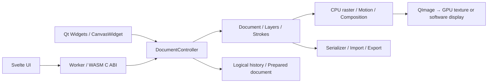
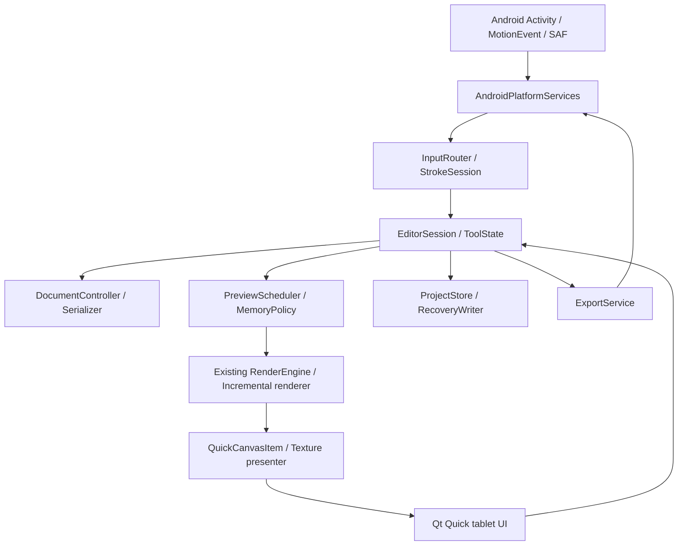

# Ugurugu Android 이식 분석 및 실행 계획

작성일: 2026-09-16 · 분석 대상: Ugurugu 2.2.10, `73004d782ba32b4e657f88e4f7387cc803ba3287`

상태: **사용자 요구를 반영한 상세 설계안. 구현 전.** 확인된 요구, 코드에서 확인한 사실, 제안과 미결정을 구분한다. 이번 작업은 분석·검증·계획서 작성이며 Android 빌드나 S Pen 실측을 수행한 상태는 아니다.

## 1. 결론과 확정 요구사항

**공용 C++/Qt 엔진을 재사용하고, Android용 입력·저장 계층과 태블릿 UI를 새로 만드는 방향을 권장한다.** 전체 엔진 재작성은 현재 근거가 없다. 다만 최우선 목표가 S Pen 필기감과 성능이므로, UI 기술은 S8 실기기에서 입력과 표시 경로를 검증한 뒤 확정한다. 우선 검증 후보는 Qt Quick/QML + C++ 캔버스이며, Android MotionEvent 연결을 보강해도 목표를 충족하지 못하면 Kotlin UI + 네이티브 캔버스 대안을 비교한다.

| 구분 | 사용자 결정 |
| --- | --- |
| 대상 | 갤럭시 탭 S8 이상, 태블릿 전용 |
| 우선순위 | S Pen 필기감과 성능 최우선 |
| 첫 버전 | PC판의 주요 기능을 갖춘 앱 |
| 화면 | 가로·세로·분할 화면 지원 |
| 입력 | 필압, 펜 버튼 지우개 전환, 호버, 손바닥 무시. 손가락 그리기는 제외 |
| 호환 | 현재 PC판 `.ugu`와 왕복 호환 |
| 제외 | `.wawa`·`.wagle`·`.wobble` 가져오기, 구버전 읽기 제거. iPad 제외 |
| 작업 보관 | 앱 내부 작업 목록에 자동 보관, `.ugu` 가져오기·내보내기 |
| 클라우드 | V1은 로컬 저장, 동기화는 후속 |
| 언어 | 한국어·영어·일본어 |
| 저장소 | `nyabi-gh/Ugurugu-Android`, 별도 비공개 저장소 |
| 배포 | 개인·지인용 APK부터 시작, 무료. 향후 상업화 가능성은 열어 둠 |
| 권리 | 사용자 확인: 코드 전부 권리 보유, 아이콘 제작자의 사용 허락 확보 |
| UX 참고 | Clip Studio Paint·ibisPaint. 세부 동작은 권장안 채택 |
| 검증 기기 | 사용자 보유 기기는 S9 추정. 연결 시 모델·RAM·OS 확인 |
| 개발 방식 | 사용자 + Codex, 별도 개발팀 없음 |

S8의 8GB 모델을 성능 기준 기기로 제안한다. 삼성 발표 사양의 S8은 11인치·최대 120Hz·8/12GB 구성이고 출시 OS는 Android 12였다. 이는 **현재 사용 중인 OS를 확인한 결과가 아니다.** FE·Lite·A 시리즈를 자동으로 “S8 이상”에 포함하지 않으며 지원 범위를 별도로 정한다. [삼성 공식 S8 사양](https://news.samsung.com/global/breaking-the-rules-with-galaxy-tab-s8-series-the-biggest-boldest-most-versatile-galaxy-tablet-ever)

기기 모델·RAM·OS는 개발 시작 후 연결할 때 확인한다. 사용자가 확정한 납기는 없으므로 기능 마일스톤으로 진행한다. 최소 OS, 캔버스 정책, 주요 내보내기 형식, 왼손잡이 배치·백그라운드 동작은 아래 권장안으로 구체화한다. 성능 수치는 기기 실측 후 조정한다.

## 2. 현재 프로젝트 분석

### 2.1 구조와 규모

물리적 줄 수는 주석·공백을 포함한다. 재사용률이나 개발 진척률을 의미하지 않는다.

| 영역 | 규모 | 책임과 이식 판단 |
| --- | ---: | --- |
| 전체 `src` | 267개 / 59,308줄 | C++23, 일부 macOS Objective-C++ |
| `src/document` | 34개 / 9,854줄 | 문서·레이어·획·선택·논리 히스토리. 핵심 재사용 |
| `src/render` | 43개 / 9,190줄 | 움직임 계산, CPU 래스터화·합성·증분 프리뷰. 핵심 재사용 |
| `src/io` | 29개 / 8,952줄 | JSON 직렬화, 외부 파일, 이미지·GIF·WebP. 경로와 메모리 정책 수정 |
| `src/ui` | 123개 / 25,386줄 | Qt Widgets 화면과 상당량의 편집 상태·입력 처리. 분리·교체 필요 |
| `src/app` | 21개 / 1,899줄 | 복구·로그·메모리·업데이트. 재사용과 플랫폼 교체 혼재 |
| `src/wasm` | 10개 / 3,102줄 | 웹 엔진 C ABI. API 설계 참고 자료 |
| 네이티브 테스트 | 54개 / 29,399줄 | 문서·픽셀·히스토리·UI 회귀 기반 |
| `web/src` | 32개 / 9,263줄 | Svelte 5·TypeScript 태블릿/폰 대응 웹 UI |
| `web/tests` | 23개 / 3,214줄 | 브라우저 시나리오 |

빌드 경계의 근거는 [UguruguSources.cmake](../cmake/UguruguSources.cmake), [UguruguTargets.cmake](../cmake/UguruguTargets.cmake), [UguruguWasm.cmake](../cmake/UguruguWasm.cmake)다. 공용 엔진은 Qt Core/Gui에 의존하지만 Widgets에는 의존하지 않는다. 다만 현재 네이티브 `ugurugu_core` 타깃에는 데스크톱 서비스도 합쳐져 있다. “공용 소스 목록이 있다”와 “Android용 독립 라이브러리가 이미 준비됐다”는 다르다.

### 2.2 문서와 편집 방식

- `.ugu`는 문서 JSON과 압축된 래스터·마스크 자산을 직렬화한다. 현재 `schemaVersion=13`, `algorithmVersion=3`이다. [SerializerSchema.hpp](../src/io/serializer/SerializerSchema.hpp)
- 문서는 단순 비트맵이 아니다. 획, 지우개, 채움, 이미지 변환, 픽셀 선택, 리프레임, 합성 경계를 기록하고 프레임별로 재생성한다. 동일 문서를 유지해야 PC와 움직임·레이어 결과를 공유할 수 있다. [Document.hpp](../src/document/Document.hpp)
- `DocumentController`가 유효성 검사·준비된 문서·변경 커밋과 히스토리를 관리한다. Android UI도 이 경계를 사용해야 한다. QML 또는 Kotlin에서 문서 필드를 직접 수정하지 않는다.
- `StrokePoint`는 현재 위치와 필압을 저장한다. 기울기 기반 붓 표현은 기존 입력을 연결하는 수준을 넘어 문서·렌더링 확장이 필요하다. 이번 요구에는 포함하지 않는다.
- 텍스트는 획 윤곽으로 변환한다. 적용한 텍스트를 계속 문자열로 편집하는 워드프로세서형 모델이 아니다. 태블릿에서도 이 의미를 유지한다.
- 일부 선택·텍스트·브러시 설정·프리뷰 세션 로직은 `CanvasWidget` 안에 있다. 엔진을 연결했다고 주요 편집 기능이 자동으로 옮겨지는 구조는 아니다.

### 2.3 렌더링과 성능

CPU가 `QImage`를 생성하고, 데스크톱 `CanvasFrameView`의 `QRhiWidget`이 텍스처 표시·확대·이동 등을 담당한다. 현재 GPU 사용을 “획 생성과 우글거림 전체가 GPU 계산”으로 해석하면 안 된다. 증분 스트로크, 레이어 분할, dirty 영역, 프리뷰 승격, 취소 토큰, 프레임 캐시를 재사용하는 것이 먼저다. [CanvasFrameView.cpp](../src/ui/CanvasFrameView.cpp), [CanvasWidgetPreview.cpp](../src/ui/CanvasWidgetPreview.cpp)

기존 네이티브 프레임 준비는 최대 8개 worker를 쓰며 별도의 interaction worker도 둔다. Android에서는 입력 중 동시성과 열·배터리 조건에 맞춰 낮춰야 한다. 스레드 수를 늘리거나 GPU 렌더러를 새로 쓰는 것을 최초 해법으로 삼지 않는다. 기존 성능 보고서의 macOS/Node 측정은 S8 성능 추정치로 사용하지 않는다. [성능 후속 문서](drawing-performance-follow-up.md)

### 2.4 기능별 이식 범위

아래 V1 포함은 “PC 주요 기능”을 구체화한 권장 범위다. 세부 동작에 대한 사용자의 위임을 바탕으로 정하며, 실행 단계도 이 범위를 기준으로 한다.

| 기능 | 현재 기반 | Android 계획 |
| --- | --- | --- |
| 브러시·지우개·필압·보정 | 공용 presets/stabilizer + Widget 입력 | V1 필수. 입력 상태와 도구 설정 분리 |
| Classic/Smooth/Stepped 우글거림 | 공용 motion/render | V1 필수, 전체/레이어별 설정 |
| 레이어·그룹·블렌드·불투명도 | 공용 controller + Widget 목록 | V1 주요 기능. 터치 가능한 목록 재작성 |
| 페인트통·자동 선택·올가미·도형 선택 | 공용 연산 + Widget 세션 | V1 포함 제안, 수정 키를 화면 컨트롤로 대체 |
| 이동·확대·회전·뒤집기·undo/redo | 공용 히스토리 + Widget 임시 상태 | V1 포함. 연속 변환 문제부터 수정 |
| 이미지 삽입·변환 | 공용 RasterAsset/ImageOp | V1 포함. Android 파일 선택·디코딩 예산 연결 |
| 캔버스/이미지 크기 변경 | 공용 DocumentOperations | V1 포함, 현재 문서와 Undo 보존 |
| 텍스트 | TextStrokeBuilder + Widget 글꼴/UI | V1 포함 제안. 한·영·일 IME와 번들 폰트 우선 |
| `.ugu` 저장·열기 | 공용 serializer | V1 필수, PC 왕복 호환 권장 |
| PNG/JPG/GIF/WebP | 네이티브 encoder 있음 | V1 포함 제안. GIF/WebP 메모리·취소 개선 필요 |
| `.wwpreset` | `src/ui/WwpPresetCodec` | 파일 교환은 후속. 기본 브러시와 마지막 도구 설정 기억은 V1 |
| 앱 내부 복사·잘라내기·붙여넣기 | SelectionClipboardCodec | V1 포함 제안. OS 이미지 클립보드는 별도 범위 |
| `.wawa` | WawaV10Reader/Importer | 제외 확정. 구현·노출·테스트·문서 모두 제거 |
| `.wagle`/`.wobble`·구형 스키마 | 호환 reader | Android판에서 제거 확정 |
| 패널 도킹·데스크톱 자동 업데이트 | Widgets / Sparkle / Velopack | Android 이식 대상에서 제외 |
| DeX 특화·폰·클라우드·결제 | 별도 설계 필요 | V1 범위 밖. iPad는 개발 고려 대상에서 제외 |

### 2.5 웹 버전을 APK로 감싸는 선택

웹판은 Worker에서 같은 엔진을 실행하고 반응형 UI·Pointer Events·증분 표시를 이미 갖췄다. 빠른 동작 확인에는 유용하다. 그러나 WASM 단일 스레드, 512MiB 엔진 상한, 모바일 신규 캔버스 1024 제한, WebP 내보내기 부재, 파일 재저장·복구·브라우저 입력 경계가 남아 있다. 웹 UI는 영어 전용이다. 이 제한은 Android 네이티브의 필수 제한이 아니다. [MemoryPolicy.ts](../web/src/lib/MemoryPolicy.ts), [웹 진행 현황](web-port-progress.md)

따라서 WebView 포장은 필기감·성능 최우선 요구의 기본안으로 권장하지 않는다. QML UI 설계 때 모바일 툴바·시트·제스처 흐름을 참고하고, 엔진 API 설계에는 WASM 브리지를 참고할 수 있다. APK 포장만으로 손바닥 취소, 펜 버튼, 프로세스 종료 복구가 완성된다고 가정하지 않는다.

## 3. 포팅에 앞서 해결할 코드 문제

기존 [2026-09-08 검토](project-review-2026-09-08.md)를 최신 코드와 대조했다. 이번에는 해당 취약 입력·변환을 다시 재현한 것이 아니라 구현 잔존 여부를 정적으로 확인했다.

| 항목 | 현재 확인 | 계획에 주는 영향 |
| --- | --- | --- |
| 압축 해제 출력량 | RasterAssetTable의 헤더 확인 후 `qUncompress` 호출이 남아 있음 | 출력 상한을 해제 도중 적용. 모바일 열기 전에 해결 |
| 연속 변환 합성 | controller 일부 이미지 경로와 CanvasWidget scale/rotate의 기존 곱 순서 잔존 | 독립 기대 좌표 기반 회귀 후 세션 추출 |
| 웹 수동 저장 순서 | 최신 `downloadDocument()`가 `enqueueExclusive` 사용 | 예전 R03을 현재 미해결로 그대로 인용하지 않음 |
| 웹 자동 복구 세대 | AutosaveController의 reset은 revision만 초기화 | 웹 코드를 복사하면 안 됨. Android는 sessionId/generation으로 설계 |
| 임시 텍스트와 저장 경계 | 네이티브 저장은 선택 변환 처리 중심 | Android에서 텍스트·획·변형별 적용/취소 정책을 명시 |
| 데스크톱 메모리 예산 | resident 목표 4GiB, history 192MiB, export 작업 512MiB | Android 프로필로 주입 가능하도록 변경 |
| 애니메이션 내보내기 | 전체 `QVector<QImage>`를 만든 뒤 encoder 호출 | 큰 애니메이션의 피크 메모리 완화 필요 |
| 메모리 탐지 | Windows/macOS만 구현, 그 외 0 | Android에서 RAM만이 아닌 프로세스 실측·동시 사용량을 반영 |
| UI 최소 크기 | MainWindow 900×640, 도킹 중심 | 세로·좁은 분할 창에서 새 레이아웃 필요 |
| 수명주기 | 30초 자동복구와 종료 flush 중심 | Android 중단·프로세스 종료에서 종료 콜백 의존 제거 |

근거: [RasterAssetTable.cpp](../src/io/serializer/RasterAssetTable.cpp), [DocumentControllerStrokes.cpp](../src/document/DocumentControllerStrokes.cpp), [CanvasWidget.cpp](../src/ui/CanvasWidget.cpp), [MemoryBudget.hpp](../src/app/MemoryBudget.hpp), [MemoryBudget.cpp](../src/app/MemoryBudget.cpp), [ExportWorker.cpp](../src/io/ExportWorker.cpp), [MainWindow.cpp](../src/ui/MainWindow.cpp), [AutosaveController.svelte.ts](../web/src/lib/AutosaveController.svelte.ts).

## 4. 비공개 저장소·라이선스·레거시 경계

### 4.1 별도 저장소 운영

새 Android 저장소에 필요한 엔진·테스트·리소스를 선별해 가져오는 초기 스냅샷 방식을 권장한다. 첫 커밋에 원본 커밋, 이관 파일 목록, 제거 목록, 자산 출처를 기록한다. macOS/Windows 설치·자동 업데이트, 웹 배포, 데스크톱 UI 전체를 관성적으로 복사하지 않는다.

- `UPSTREAM.md`: 기준 커밋, 이식한 공용 코드, Android 수정 사항, 후속 동기화 이력.
- `docs/architecture.md`: 엔진/세션/Android/UI 책임과 스레드 소유권.
- `docs/format-compatibility.md`: 읽기·쓰기 스키마, PC 상호 운용 범위.
- `docs/android-validation.md`: 실제 기기·OS·빌드·입력·성능·복구 결과.
- 공용 버그 수정은 양쪽의 적용 여부를 기록하고, UI와 모바일 메모리 정책은 분리한다. 원본 변경을 자동 전체 병합하면 제거한 레거시가 돌아올 수 있으므로 선별 이관한다.
- 현재 공개 저장소에서 이미 배포된 코드의 라이선스·기록과 Android판에 적용할 라이선스를 구분한다. 비공개 APK 전달 경로는 별도로 정하며 저장소를 공개로 전환할 필요는 없다.

### 4.2 비공개 앱 소스 배포 조건

현재 공개 프로젝트는 GPL-3.0-or-later이며, [CONTRIBUTING.md](../CONTRIBUTING.md)는 기여자가 저작권을 유지한다고 명시한다. 사용자는 이번 대화에서 코드 전부의 권리 보유와 아이콘 제작자의 허락을 확인했다. **이를 전제로 Android판 앱 코드에는 별도의 비공개 배포 라이선스를 적용한다.** 아이콘 허락 범위는 향후 상업화 때도 사용할 수 있는지 기록해 둔다. Git 작성자 목록만으로 권리를 추정한 결정은 아니다.

저작권자는 자기 코드를 다른 라이선스로도 제공할 수 있다. 이번에는 사용자의 권리 확인에 따라 그 경로를 채택한다. 비공개 저장소 설정만으로 기존 GPL 조건이 바뀌는 것은 아니므로 Android 자체 코드의 배포 조건을 문서화한다. 무료 배포 여부와 소스 공개 여부는 별개다. [GNU FAQ: 저작권자의 다른 라이선스 제공](https://www.gnu.org/licenses/gpl-faq.en.html#ReleaseUnderGPLAndNF)

Qt는 앱 자체의 라이선스와 별도로 검토한다. 앱 소스를 비공개로 유지하면서 LGPL 조건을 준수하는 경로와 Qt 상용 라이선스 경로가 있다. 사용 모듈의 라이선스, Qt 소스 제공, 교체·재링크·설치 가능성, 관련 고지와 배포 조건을 확인한다. APK에서 Qt 라이브러리를 바꿔 재패키징·설치하는 절차까지 검증한다. [Qt 라이선스](https://doc.qt.io/qt-6/licensing.html), [Qt LGPL 의무](https://www.qt.io/development/open-source-lgpl-obligations)

초기 후보는 Core/Gui/Qml/Quick/QuickControls2 등 필요한 모듈만이다. 기본안은 LGPL 사용 가능 모듈의 동적 링크와 의무 준수이며, 이를 만족시키기 어려울 때 Qt 상용 라이선스를 별도 비용으로 검토한다. 시스템 키보드를 사용하고 Qt Virtual Keyboard를 불필요하게 포함하지 않는다. 새 저장소의 자체 코드 고지는 확인된 권리에 맞게 정리하고 외부 구성요소 고지는 유지한다. 공개 원본에 이미 부여한 GPL 권리를 소급 철회하는 작업은 아니다.

### 4.3 레거시 정리 방법

1. `.wawa`: WawaV10Reader/Importer, CMake 소스 목록, 전용 fuzz/test, 파일 선택 필터, 안내·번역·도움말을 Android판에서 제거한다.
2. 데스크톱 전용: Sparkle, Velopack, MacWindowChrome, WinTab, 데스크톱 도킹·패키징·단일 실행 제약을 이관 대상에서 뺀다.
3. 구형 파일: `.wagle`/`.wobble` 별칭과 schema 1~12·algorithm 1~2 reader를 제거한다. **현재 schema 13 / algorithm 3만 Android에서 읽고 쓰며**, 오래된 작업은 PC에서 현재 `.ugu`로 다시 저장한다. 현재 형식의 정상 파일을 구형 reader 제거 과정에서 손상시키지 않도록 먼저 현행 fixture를 확보한다.
4. 테스트: 옛 확장자 fixture라도 현재 렌더링 의미를 검증하면 현행 `.ugu` fixture로 변환하고 테스트 의도를 남긴다. 이름에 legacy가 있다는 이유만으로 픽셀 회귀를 버리지 않는다.
5. `ClassicStrokeMotion`은 현재 PC 기본 모션에도 사용된다. 구버전 가져오기 제거와 별개의 제품 기능이므로, PC 왕복 호환을 유지하는 기본안에서는 보존한다.

## 5. 구현 방식 비교와 선택 기준

| 방식 | 장점 | 부담 | 이 요구에서의 판단 |
| --- | --- | --- | --- |
| 기존 Qt Widgets 그대로 이식 | 엔진뿐 아니라 UI·입력도 많이 재사용 | 도킹·작은 컨트롤·최소 크기·모달·터치 UX 수정이 큼 | 빠른 기술 확인용 후보 |
| Qt Quick/QML + C++ 엔진 | 같은 런타임, 태블릿 UI 설계 자유, Qt 자료형·렌더 기반 유지 | CanvasWidget 세션 추출과 Quick 표시·입력 어댑터 필요 | **우선 검증안** |
| Kotlin/Compose UI + C++/Qt 엔진 | Android 입력·수명주기·플랫폼 UI 직접 제어 | JNI, Qt 초기화/이벤트 루프, 표면·스레드·이미지 전달 비용 추가 | Qt 경로가 필기감 목표를 못 맞출 때 비교 |
| Svelte/WASM + WebView | 기존 반응형 화면 재사용 | 입력 경계·메모리·복구·기능 차이와 브라우저 런타임 | 빠른 체험판 외 기본안 아님 |
| Kotlin/Skia로 엔진 재작성 | 장기 플랫폼 제어 자유 | 3만 줄 가까운 문서·렌더·IO 의미 및 회귀 재구현 | 현 단계 근거 부족 |

Qt는 Android에서 Widgets와 Quick을 제공하고 Android 연결부를 갖춘다. 따라서 Qt 사용 자체가 포팅 장애는 아니다. 어떤 입력·표시 경로가 S8 목표를 만족하는지는 실측 대상이다. [Qt for Android](https://doc.qt.io/qt-6/android.html)

**결정 게이트:** 같은 문서·입력 궤적·프리뷰 해상도로 Qt Quick 경로를 측정한다. 이벤트 손실/취소 누락이면 MotionEvent 브리지를 먼저 보완하고, CPU 래스터 병목이면 공용 엔진을 개선한다. UI 교체가 해결하는 병목일 때만 Kotlin 대안을 진행한다. 단순 선의 초저지연 별도 렌더가 가능하더라도 최종 붓·마스크·블렌드와 다르면 정답으로 채택하지 않는다.

## 6. 권장 구조와 변경 단위

표의 새 이름과 경로는 설계 제안이며 현재 파일이 아니다.

| 단위 | 책임 | 원본에서 참고·이관할 코드 |
| --- | --- | --- |
| `engine/` | 문서·브러시·렌더·직렬화·히스토리 | `UGURUGU_ENGINE_SOURCES`, Wawa 제외 |
| `editor/EditorSession` | 문서 identity, revision, dirty, 저장·교체 순서 | MainWindow의 세션 부분, DocumentController |
| `editor/StrokeSession` | 입력 시작/추가/완료/취소, 단일 undo | CanvasWidgetEvents/Tools, StrokeStabilizer |
| `editor/SelectionSession` | 임시 변형, 적용·취소, 좌표계 | CanvasWidgetSelection, CanvasViewport |
| `editor/ToolState` | 도구·색·필압·프리셋 설정, 안정된 ID | DrawingToolSettings의 CanvasWidget enum 의존 제거 |
| `editor/PreviewScheduler` | 최신 결과 채택, 취소, 캐시·백그라운드 우선순위 | CanvasWidgetPreview와 PreviewMemoryUsage |
| `ui/QuickCanvasItem` | 이미지 표시, 캔버스 변환, overlay | CanvasFrameView의 표시 원칙. QRhiWidget 직접 재사용 아님 |
| `ui/qml/` | 툴바·레이어·색·우글·프레임·다이얼로그 | 기존 기능과 웹 시트 흐름을 기준으로 신규 구현 |
| `platform/android/` | 문서 선택·공유·수명주기·메모리·펜 보강 | 신규 Kotlin/Java + 좁은 JNI 경계 |
| `services/` | 복구·내보내기·로그 | RecoveryWriter/Store, ExportWorker 재구성 |

세션/문서 변경은 한 소유 스레드에서 직렬 처리한다. 렌더 worker에는 불변 스냅샷과 generation을 넘기고, 오래된 결과는 채택하지 않는다. Quick scene graph 자원은 render thread에서 관리한다. 캔버스 회전·리사이즈·백그라운드 복귀 시 GPU 자원 재생성과 CPU 문서 보존을 분리한다. [QQuickItem 스레드·자원 규칙](https://doc.qt.io/qt-6/qquickitem.html)

표시 경로는 기존 QImage를 텍스처로 전달하는 방식부터 측정한다. QQuickPaintedItem을 최종 성능 해법으로 고정하지 않는다. dirty 영역 업로드·전체 이미지 복사 비용을 계측하고, 필요할 때 표시 계층만 최적화한다. QML에서 획마다 JSON/전체 이미지를 변환해 주고받는 설계는 피한다.

## 7. S Pen 입력과 태블릿 화면

### 7.1 입력 계약

| 입력 | V1 동작 |
| --- | --- |
| 펜 접촉 | 현재 도구로 편집. 브러시·지우개는 필압 적용 |
| 펜 버튼 | 기본은 누르는 동안 임시 지우개, 놓으면 이전 도구 복귀. 토글 방식은 설정으로 제공 |
| 펜 호버 | 문서에 표시를 남기지 않고 브러시 크기·선택 도구 위치 표시 |
| 손가락 한 개 | 캔버스에 획을 만들지 않음. 화면 버튼·패널은 정상 조작 |
| 손가락 두 개 | 이동·핀치 확대·회전. 시작 위치와 앵커 보존, 작은 회전 떨림에 dead zone 적용 |
| 펜으로 그리는 중 손바닥 접촉 | 획·제스처·패널 오작동 억제. 펜 접촉이 끝나면 정상 터치로 복귀 |
| 입력 취소·포커스 상실 | 진행 중 임시 입력을 취소. 이미 커밋한 다른 획은 유지 |
| 화면 가장자리 시스템 제스처 | OS 취소 이벤트를 처리하고 미완성 획을 확정하지 않음 |

펜 버튼은 일반 버튼 상태로 처리하는 것을 우선하며 Bluetooth 원격 Air Actions는 요구하지 않는다. 시스템의 S Pen 단축 동작과 앱 입력이 충돌하는지는 실제 기기에서 확인한다. 버튼을 획 도중 누르면 현재 획을 경계에서 마치고 새 모드의 획으로 전환해 이미 그린 부분 전체가 지우개로 바뀌지 않게 한다. 호버 상태에서는 도구 표시만 바꾼다.

Android의 stylus API는 도구 종류·압력·호버·버튼/축 정보의 기반을 제공한다. Qt 이벤트에 전달되는 정보와 누락 여부를 먼저 기록한다. historical sample, pointer ID, timestamp, cancel 정보를 보존해야 하며 Qt 이벤트와 JNI 이벤트를 동시에 받아 같은 획을 두 번 그리지 않는다. [Android stylus 입력](https://developer.android.com/develop/ui/views/touch-and-input/stylus-input/advanced-stylus-features)

손바닥 차단은 단순히 touch를 모두 무시하는 것으로 끝나지 않는다. `ACTION_CANCEL`, Android 13 이상에서의 `FLAG_CANCELED`와 pointer별 취소를 반영해야 한다. Android 12에서 얻을 수 없는 취소 정보는 펜 전용 드로잉과 펜 우선 제스처 정책으로 보완하고 제한을 검증한다. 취소를 전체 undo로 구현하면 정상 펜 획까지 지울 수 있으므로 임시 pointer 세션을 따로 버린다. [Android palm rejection](https://developer.android.com/develop/adaptive-apps/cookbook/stylus-palm-rejection)

입력 예측은 선택적 후속 최적화다. 사용한다면 예측점은 화면 미리보기에만 넣고 저장·히스토리·최종 렌더에는 실제 점만 사용한다. Android Ink API의 기본 붓으로 엔진을 대체하면 현재 브러시·우글거림 표현이 바뀌므로 별도 결정 없이는 하지 않는다.

### 7.2 화면 구성

Clip Studio의 Simple Mode처럼 캔버스 공간을 먼저 확보하고, ibisPaint처럼 펜/터치 역할을 명확히 구분하는 방향을 참고한다. 앱 고유의 레이어·우글거림·프레임 흐름에 맞춰 배치하며 외부 앱 UI·자산을 복제하지 않는다. [Clip Studio 태블릿 UI](https://help.clip-studio.com/en-us/manual_en/090_tablet/Tablet_interface.htm), [ibisPaint 손바닥 설정](https://ibispaint.com/lecture/index.jsp?no=199)

| 창 상태 | 배치 |
| --- | --- |
| 넓은 가로 | 한쪽 도구 rail, 반대쪽 접을 수 있는 레이어/색 패널, 하단 접이식 프레임 바 |
| 세로 | 얇은 상단 명령 바, 하단 주요 도구, 레이어·색·우글 설정은 시트/접이식 패널 |
| 좁은 분할 화면 | 캔버스 + 필수 도구만 상시 표시. 세부 설정은 한 번에 하나의 시트 |
| 왼손잡이 | 도구·보조 패널 좌우 전환. 설정 기억 |
| 키보드가 열린 상태 | 텍스트 입력과 적용/취소 버튼이 가려지지 않도록 공간 재계산 |

레이아웃 판단은 물리적 태블릿 모델이나 화면 회전 값보다 **현재 앱 창의 가용 크기**를 따른다. 초기 설계 구간은 폭 600 미만, 600~839, 840 이상 논리 단위이며 QML 좌표·Android dp 대응을 기기에서 확인한다. 주요 터치 영역은 48dp 상당을 목표로 하고 실제 폰트 배율에서도 버튼 이름과 수치를 읽을 수 있어야 한다.

문서·현재 레이어·줌/회전·미적용 세션을 화면 재배치와 분리한다. resize만으로 새 문서를 만들거나 선택을 확정하지 않는다. 두 손가락 상태에서 시스템이 창 크기를 바꾸면 입력을 안전하게 취소하고 뷰 변환을 갱신한다.

Android 16을 target하는 대화면 앱은 방향·크기 제한이 무시될 수 있으므로 가로 잠금으로 대응하지 않는다. 상태 표시줄·내비게이션 바·cutout·IME inset과 시스템 뒤로 가기도 구현한다. 뒤로 가기는 시트 닫기 → 임시 편집 취소/처리 → 작업 목록 이동 순으로 동작한다. [Android 대화면 크기 변경](https://developer.android.com/develop/adaptive-apps/guides/app-orientation-aspect-ratio-resizability), [edge-to-edge](https://developer.android.com/develop/ui/views/layout/edge-to-edge)

### 7.3 번역·접근성

기존 한·일 번역은 Qt Widgets context가 많으므로 QML에서 자동 재사용된다고 가정하지 않는다. 엔진 오류 문구는 유지하고 새 화면 context에 번역을 연결한다. 한국어·영어·일본어로 작업 목록, 모든 편집 패널, 오류, 내보내기, 복구, 고지를 제공한다. OS 언어 기본 + 앱 내 언어 선택을 지원한다.

Pretendard JP 번들 폰트를 우선 사용하고 한글 조합·일본어 변환·키보드 표시/숨김을 시험한다. 아이콘만 있는 버튼의 접근성 이름, 슬라이더 현재값, 레이어 순서, 포커스 순서와 대비를 확인한다. 필기감 측정과 별개로 실제 손가락으로 모든 필수 버튼을 눌러 완료할 수 있어야 한다.

## 8. 작업 목록·자동 저장·파일 호환

### 8.1 로컬 프로젝트 저장소

V1은 로그인·인터넷 없이 작업할 수 있게 만든다. 새 그림은 즉시 앱 작업 목록의 고유 project ID를 받고, 가져온 `.ugu`도 앱 저장소 안의 독립 작업으로 채택한다. 이름 변경·복제·삭제·최근 수정 정렬·썸네일을 제공한다. 외부 파일에 원치 않는 덮어쓰기가 발생하지 않도록 내부 저장과 `.ugu` 내보내기 상태를 구분한다.

권장 내부 구성은 project ID별 디렉터리, 세대별 `.ugu` snapshot, 메타데이터, 썸네일이다. 새 snapshot을 완전히 기록한 뒤 현재 세대를 가리키는 메타데이터를 원자적으로 교체하고 직전 정상 세대를 보존한다. 썸네일·목록 index가 늦게 갱신돼도 본문 snapshot으로 복구할 수 있어야 한다. 시작 시 미완료 임시 파일과 고아 세대를 안전하게 정리한다.

내부 파일 형식은 PC와 같은 `.ugu`를 활용하되 project ID·내보낸 위치·수정 시각 등 앱 관리 정보는 별도 메타데이터로 둔다. Android UI 편의를 이유로 공유 `.ugu` 스키마에 기기 전용 필드를 섞지 않는다. 삭제는 짧은 기간의 휴지통 또는 복구 가능 보관을 우선하고 용량 정리 UI를 둔다.

### 8.2 자동 저장과 앱 수명주기

- 일반 편집은 idle 약 1.5초 뒤 snapshot을 예약하고 최신 revision 하나로 합친다. 연속 작업 중에는 최대 약 10초 간격으로 저장을 시도한다. 이 값은 S8 직렬화 비용으로 조정하며 무손실 보장 시간으로 광고하지 않는다.
- 직렬화·파일 쓰기는 UI 밖에서 처리한다. 자동 저장 때문에 pen-down 경로에서 전체 JSON을 생성하지 않는다.
- 명령에는 project ID/session ID/revision/generation을 포함한다. 이전 문서의 완료가 새 작업의 저장 상태를 바꾸지 않게 한다.
- 작업 목록으로 이동하거나 다른 작업을 열 때 먼저 현재 임시 편집을 정리하고 저장 완료를 확인한다. 실패하면 재시도·파일 내보내기·계속 편집을 제공한다.
- 백그라운드 전환 시 이미 완료된 편집의 저장을 우선 예약하고 재생·프레임 예열을 중지한다. 장시간 동기 flush로 Android UI thread를 막지 않는다.
- 회전/분할 화면 변경과 실제 프로세스 종료를 구분한다. 종료 후에는 마지막 완전한 snapshot으로 복구하며 중간 기록을 정상 작업으로 채택하지 않는다.
- 저장 상태는 “저장 중 / 기기에 저장됨 / 저장 실패”로 알린다. 내부 저장 성공과 외부 공유 완료를 같은 표시로 묶지 않는다.

Android는 프로세스를 종료하면서 `onDestroy()`를 호출하지 않을 수 있다. 기존 `RecoveryWriter` 소멸자의 flush나 창 closeEvent만으로는 충분하지 않다. 초기 V1은 snapshot 방식으로 측정하고, 큰 문서의 저장 비용이 필기감을 방해할 때만 저널/증분 영속화를 별도 설계한다. 기존 메모리 undo 구조가 바로 디스크 저널이 되는 것은 아니다. [Android 프로세스 수명](https://developer.android.com/guide/components/activities/process-lifecycle)

### 8.3 `.ugu` 가져오기·내보내기와 공유

Android SAF를 통해 선택한 `content://` URI를 읽고 쓴다. 이를 일반 경로로 간주해 `QFileInfo::absoluteFilePath()`나 확장자 덧붙이기에 넘기지 않는다. 이름·MIME·크기·접근 권한을 별도 데이터로 취급하며 파일 크기가 알려지지 않아도 읽기 누적 상한을 적용한다. [Qt QFile의 Android 제약](https://doc.qt.io/qt-6/qfile.html), [Android 문서 접근](https://developer.android.com/training/data-storage/shared/documents-files)

입력은 크기 제한 → 내부 임시 파일/제한된 바이트 읽기 → 형식·예산 검증 → 새 프로젝트 채택 순서다. 실패·취소·지원하지 않는 구버전이면 현재 작업을 보존한다. 출력은 내부에서 완전한 파일 생성 → 사용자가 선택한 URI에 복사 → 성공 확인 순서다. 내부 QSaveFile의 원자성이 외부 provider 전체에도 적용된다고 가정하지 않는다. 외부 저장 실패 시 내부 원본은 남긴다.

V1은 가져오기·내보내기 중심이므로 외부 URI의 영구 접근 권한을 기본으로 수집하지 않는다. 이후 “최근 내보낸 곳에 재저장”을 도입할 때 persistable permission과 철회·이동·삭제를 처리한다. 자체 파일 형식은 provider별 MIME 판정이 다를 수 있으므로 확장자와 파일 본문을 함께 검증한다.

이미지/애니메이션 공유는 완성 파일의 content URI와 일시 접근 권한을 제공하는 FileProvider 기반으로 구성한다. 공유 선택기를 연 것과 수신 앱의 실제 업로드 완료는 구분한다. [Android 파일 공유](https://developer.android.com/training/secure-file-sharing)

PC 호환 완료 조건은 PC 생성 → Android 편집·내보내기 → PC 재열기 → 다시 Android 열기의 양방향 왕복이다. 레이어 hierarchy, UUID, 브러시 seed, 필압, 이미지 alpha, 선택/변환, 우글 설정, 프레임 수·fps가 보존돼야 한다. 메모리 한도 초과 파일은 사유와 축소 방법을 안내하고 **자동 축소해 원본을 덮어쓰지 않는다.** PC에 없는 Android 전용 문서 필드는 V1에서 만들지 않는다.

## 9. 메모리·내보내기·성능 검증

### 9.1 초기 기기 정책

다음 숫자는 **실측 전 시작값**이다. S8 8GB에서 안정적으로 동작한다고 확인된 한도가 아니다. 문서 포맷이 허용하는 최대치와 정상적으로 편집 가능한 작업량을 구분한다.

| 항목 | 제안 |
| --- | --- |
| 기본 새 캔버스 | 1600×1200, 30프레임, 12fps |
| 일반 새 캔버스 최대 | 2048×2048로 시작 |
| PC에서 온 최대 4096 문서 | 별도 admission 검사. 통과하면 프리뷰 축소로 편집, 미통과 시 원본 보존 후 거절 |
| 레이어 | 형식 상한 256 유지. 기본 성능 시나리오는 8/16/32 레이어로 측정 |
| undo | 64단계 + 64MiB부터 시작. 개수와 실제 메모리 한도 모두 적용 |
| 프리뷰 전체 표면 | 합계 128MiB부터 시작. 프레임 캐시마다 따로 128MiB를 주지 않음 |
| 래스터 디코딩 캐시 | 64MiB부터 시작 |
| 직렬화 캐시 | 16MiB부터 시작 |
| 내보내기 작업 예산 | 192MiB부터 시작, 문서·히스토리·GPU 등 동시 사용량 추가 반영 |
| 프로세스 관측 목표 | 일반 시나리오 PSS 512MiB 이하, 스트레스 피크 768MiB 이하를 최초 목표로 측정 |
| 렌더 동시성 | 입력 중 current interaction 우선, frame warmup 1~2개부터 측정 |

이는 예산을 모두 예약 할당하라는 뜻이 아니다. native heap·Qt·Java·GPU·직렬화 임시 사본과 decoder 메모리도 포함해 실제 peak PSS/RSS를 측정한다. Android의 Java heap 한도를 앱 전체 native 메모리 한도라고 해석하지 않는다. 메모리 압력에서는 재생 캐시·썸네일·디코딩 캐시부터 줄이고 사용자 작업을 버리지 않는다.

2048² RGBA 한 장은 16MiB, 30장은 480MiB다. 4096² 한 장은 64MiB, 30장은 1,920MiB다. 이는 단순 픽셀 배열만의 계산이며 실제 encode 비용은 더 크다. 따라서 기존 전체 프레임 수집 방식을 그대로 쓰면 V1 목표 예산과 맞지 않는다.

### 9.2 내보내기 변경

1. PNG/JPG는 원본 해상도 정확 렌더와 파일 생성, 진행 상태·취소·실패 복구를 제공한다.
2. GIF는 frame provider/증분 writer 인터페이스를 검토해 전체 QImage 집합 보관을 제거한다. 팔레트·투명도·프레임 딜레이·loop 결과를 기존 결과와 비교한다.
3. WebP는 프레임을 순차 공급하더라도 libwebp 내부 보관 비용이 있으므로 일정 메모리라고 가정하지 않는다. 실제 encoder peak를 포함해 지원 크기를 결정한다.
4. preview용 축소 replay 결과를 고품질 내보내기에 쓰지 않는다. 기존 NativeExact 의미를 유지한다.
5. 내보내기 시작 때 transient cache를 정리하고 snapshot revision을 고정한다. 원본 편집 상태는 그대로 유지한다.
6. V1은 **앱이 보이는 동안 완료하는 내보내기**를 기준으로 한다. 앱이 완전히 백그라운드로 가면 취소 요청하고 복귀 시 다시 시작할 수 있게 한다. 부분 출력은 정상 결과로 내보내지 않는다. 분할 화면에서 앱이 계속 보이는 경우에는 진행 가능 여부를 lifecycle 상태에 맞춰 판정한다.
7. 장시간 백그라운드 처리·알림·재시도 서비스는 실제 필요가 생기면 후속으로 추가한다. 단순 QThread를 Android 보장 백그라운드 작업으로 취급하지 않는다.

GIF/WebP 큰 출력은 크기·프레임 수별 예상 비용과 축소 옵션을 제공한다. 지원하지 못하는 조합을 조용히 품질 저하시키지 않는다. 내보내기 전체 시간을 줄이기 위해 필기 입력과 모든 코어를 경쟁시키지 않는다.

### 9.3 성능 기준과 측정법

| 측정 | 최초 수용 목표 | 조건 |
| --- | --- | --- |
| Android 이벤트 수신 → 잉크 표시 | p95 33ms 이하 목표 | 표준 문서, 펜 보정 낮음, 실제 presentation 측정 가능 경로 |
| 한 입력 batch의 UI thread 점유 | p95 4ms 이하 목표 | 매 샘플 로깅 비활성, Release |
| 화면 이동·확대·회전 | 60Hz에서 프레임 p95 16.7ms 이내 목표 | 렌더 해상도 재계산과 texture upload 포함 |
| 120Hz | 8.3ms 프레임 예산 충족 여부 별도 보고 | 디스플레이 120Hz와 그림 애니메이션 fps는 별개 |
| 일반 획 커밋 | p95 16.7ms 이하 목표 | 정상 증분 경로. 무거운 연산과 구분 |
| 첫 획 | 열린 직후·undo 직후도 별도 측정 | 평균 연속 획 수치로 cold 지연을 감추지 않음 |
| 내구 | 30분 연속 그리기·재생·전환 | crash/ANR·단조 메모리 증가 없음, 발열 후 수치 기록 |
| 정확성 | 실제 입력 누락·중복·취소 오커밋 0 | 자동 궤적과 실제 S Pen 각각 |

이 값은 제품 보장이나 이미 달성한 결과가 아니다. 보정 강도에 따른 의도적 지연도 분리한다. Android event time, Qt 처리 시작, 엔진 patch 완료, texture upload, presentation의 타임라인을 계측하고 시계 기준을 보정한다. CPU 함수 실행 시간만 재고 “펜 지연”이라고 부르지 않는다. 화면에 실제 잉크가 보이는 end-to-end 지연은 고속 촬영 등으로 별도 확인한다.

표준 데이터셋은 Wave.ugu, 1024² 가벼운 문서, 2048²·8/16레이어 혼합 문서, 2,000획·200,000점 스트레스 문서, 4096² 이미지·마스크·중첩 그룹 문서로 구성한다. 사용자 실제 파일은 공개 저장소/로그에 넣지 않고 동의된 로컬 검증에만 사용한다. 기기·OS·전원/절전·주사율·온도·빌드 해시와 p50/p95/max를 기록한다.

## 10. Android 빌드·테스트·배포

### 10.1 도구와 패키지

| 항목 | 계획 |
| --- | --- |
| ABI | 배포는 `arm64-v8a`. 에뮬레이터 ABI는 호스트에 맞춰 별도 debug 구성 |
| Qt | 기존 릴리스 6.11.1을 최초 비교 기준으로 사용. 채택 patch 버전을 host/Android/CI 전체에서 정확히 고정 |
| NDK | Qt 공식 키트와 맞는 r27c / 27.2.12479018을 최초 후보로 검증 |
| SDK | compile/target API 36을 시작안으로 검증. 배포 시점 정책과 Qt 호환성을 다시 확인 |
| 최소 OS | Android 12 / API 31 제안. S8 출시 OS까지 포함하되 12와 13 이상 입력 취소 차이를 시험 |
| Java/Gradle | JDK 21, 선택한 Qt patch의 Android 템플릿과 호환되는 Gradle/AGP를 고정 |
| CMake | 기존 3.31 이상 요구 유지. Android 전용 preset/toolchain, host tools 경로 분리 |
| 앱 ID | `dev.ugurugu.android` 제안. 첫 외부 배포 전에 확정해 유지 |
| 버전 | Android 자체 versionName/versionCode. 원본 engine commit은 별도 진단 정보 |
| 산출물 | 개발 debug APK → 동일 배포 키로 서명한 release APK. AAB/스토어 자동 게시 후속 |

2026-09-16 조회한 Qt 6.11 문서는 Android 9~16, JDK 21, NDK r27c를 지원 구성으로 안내한다. 이는 Qt 자체 하한이며 이 앱의 API 31 제안과 다르다. 현재 문서의 Gradle/AGP를 이전 patch 템플릿에 무조건 덮어쓰지 않고 실제 키트와 함께 검증한다. [Qt 지원 구성](https://doc.qt.io/qt-6/supported-platforms.html), [Android 개발 준비](https://doc.qt.io/qt-6/android-configure-dev-environment.html)

Android용 native library와 Qt plugin, libc++를 포함한 **모든 배포 `.so`**의 16KB page 정렬을 검사한다. 선택한 NDK에 맞는 링크 옵션을 확인하고 APK ZIP 정렬·ELF LOAD/RELRO 정렬·16KB 환경 실행을 함께 검사한다. NDK 업그레이드나 앱 라이브러리 하나의 옵션만으로 기존 prebuilt Qt가 자동 수정되지는 않는다. 개인 APK에도 실제 기기 호환성 문제이므로 스토어 출시 때까지 미루지 않는다. [Android 16KB 지원](https://developer.android.com/guide/practices/page-sizes)

현재 환경에서 Android 도구를 설치한 것은 아니다. `adb`는 PATH에서 찾지 못했고, 확인한 일반 SDK/Qt Android 설치 위치에서도 키트를 찾지 못했다. 다른 위치에 설치돼 있을 가능성은 남아 있다. 개발 시작 때 기존 도구를 재탐색하고 필요한 키트만 설치한다.

### 10.2 CMake와 CI 변경

1. Android 엔진 target과 UI target을 분리한다. 데스크톱 Widgets/GuiPrivate/Sparkle/Velopack 의존성을 Android 기본 빌드에 강제하지 않는다.
2. C++23 기능의 NDK libc++ 호환성을 실제 compile/link로 확인한다. 실패 시 필요한 코드만 이식하고 전체 엔진 언어 수준을 근거 없이 바꾸지 않는다.
3. libwebp/spdlog는 기존 검증 버전·hash를 기준으로 Android ABI용 빌드를 추가한다. 압축 해제 상한 구현에 외부 zlib 직접 사용이 필요하면 명시적 의존성·라이선스·Android 링크를 기록한다.
4. `Qt6::Test` 기반 엔진 테스트를 Widgets UI 테스트에서 분리한다. 현재 CTest는 offscreen 호스트 앱이므로 그대로 APK 테스트가 되는 것이 아니다.
5. QML 정적 검사·번역·공용 unit/golden → Android APK build → 에뮬레이터 설치/실행/복구 → 서명/패키지 검사 순으로 CI를 구성한다.
6. 에뮬레이터 검사는 수명주기·파일·리소스·페이지 크기에 사용한다. S Pen hover/버튼/손바닥·필기감 통과 판정은 실기기에서 한다.
7. release signing key는 저장소에 넣지 않는다. CI 비밀값 또는 로컬 배포 환경에서 주입하고, native debug symbols와 mapping을 빌드 버전에 맞춰 별도 보관한다.
8. 기존 CI의 GPL 헤더 강제, 공개 저장소 링크·릴리스 자동 게시·download badge는 새 비공개 프로젝트 정책에 맞게 교체한다. 원본 CI를 그대로 복사해 실행하지 않는다.

### 10.3 검증 행렬

| 축 | 최소 범위 |
| --- | --- |
| 기기 | 사용자 보유 S9 추정 기기 + S8 8GB. 후자는 별도 확보/대여 등 검증 경로 필요 |
| OS | 최소 API 31, API 33 이상 취소 처리, 최신 지원 OS. 실제 사용 가능한 조합 기록 |
| 화면 | 가로·세로·분할 1/2·더 좁은 창·split 중 resize·큰 글씨·IME |
| 입력 | 낮은/높은 필압, 빠른 점·긴 곡선, 펜 버튼, 호버, palm 먼저/펜 먼저, 두 손가락과 펜 교대 |
| 문서 | 빈 문서, 이미지 포함, 투명도/블렌드/clip, 중첩 그룹, 선택 변형, 텍스트, 최대 근처 파일 |
| 저장 | 작업 교체, 가져오기 취소, 저장 공간 부족, 쓰기 실패, process kill, 재실행·업데이트 설치 |
| 출력 | PNG/JPG/GIF/WebP의 alpha·프레임 수·duration·loop, 취소·provider 실패·공유 |
| 장시간 | 30분 이상 사용, 반복 열기/닫기, 발열 후 입력, 저전력 모드 |
| 언어 | 한·영·일, 한글 조합과 일본어 변환, 잘린 라벨·읽기 순서 |
| 패키지 | 새 설치·서명 동일 업데이트·앱 데이터 유지·Qt plugins·16KB·기기 오프라인 |

S9에서의 통과를 S8 보장으로 기록하지 않는다. S8 확인 전 배포한다면 해당 APK의 실측 기기와 지원 검증 상태를 분명히 적는다. 같은 Snapdragon 여부만으로 성능·드라이버·열 특성을 대신하지 않는다.

### 10.4 PC 왕복 회귀

- 같은 입력 궤적·seed·파일로 desktop/native Android의 문서 구조와 저장 의미를 비교한다.
- 렌더 골든은 정확한 Qt 버전·폰트·색 공간을 고정한다. 우선 픽셀 동일성을 요구하되 아키텍처/래스터 차이가 나오면 원인을 밝힌 후 허용 범위를 승인된 fixture별로 명시한다. 광범위한 tolerance로 실패를 덮지 않는다.
- 기존 `.ugu` 읽기 → 저장이 지원하지 않는 필드를 소리 없이 누락시키지 않는지 확인한다. 미래 schema는 명시적으로 거절한다.
- 구버전 거절 테스트와 현행 파일 테스트를 따로 두고, `.wawa` 제거가 현행 Classic 모션을 바꾸지 않는지 검증한다.

## 11. 실행 순서와 완료 조건

달력 기간을 임의로 약속하지 않는다. Codex가 구현·자동 검증을 담당하고 사용자가 기기 설치와 실제 펜 감각을 확인하는 협업이므로, 첫 Android 실기기 결과와 피드백 빈도를 본 뒤 다음 마일스톤의 작업량을 재산정한다. 각 단계는 검토 가능한 작은 변경으로 나누며 완료 조건을 통과한 결과만 다음 단계의 기반으로 삼는다.

| 단계 | 작업과 산출물 | 선행 조건 | 완료 조건 / 판단 |
| --- | --- | --- | --- |
| P0 범위·이관 기준 | 비공개 저장소, 자체 라이선스·외부 고지, UPSTREAM, 현행 파일 fixture, 제외 목록 | 현재 계획 | 앱 코드 권리 기록, 현재 포맷 계약과 제품 범위 고정 |
| P1 Android 기술 검증 | arm64 debug APK, 공용 엔진 프레임 표시, 펜 진단, Qt Quick 표시, 저장 임시 파일 | P0·도구 설치·기기 연결 | 실기기 실행·압력/호버/버튼/cancel 기록·프레임 표시·기본 `.ugu` 왕복 |
| P2 필기감 경로 결정 | 증분 stroke → texture, 이벤트/표시 계측, palm/gesture 상태, S8 측정 계획 | P1 | 표준 문서 지연·정확성 게이트. 미달 시 원인별 개선 또는 Kotlin 대안 PoC |
| P3 공용 세션 정리 | 엔진/UI 분리, EditorSession/ToolState/selection, 압축·변환 수정, 구형 reader 제거 | P1, P2 경계 합의 | 코어 회귀·현행 파일 호환·기본 편집 상태 테스트 통과 |
| P4 태블릿 편집 화면 | rail/시트, 색·브러시·레이어·우글·timeline, 가로/세로/split, 좌우 배치 | P2·P3 | 펜으로 그리고 레이어/움직임/undo를 화면만으로 조작 |
| P5 작업 보관·복구 | 작업 목록, 자동 snapshot, 가져오기/내보내기 SAF, lifecycle, 오류 UI | P3, P4 최소 화면 | 강제 종료·공간 부족·작업 교체에도 마지막 정상 작업 보존 |
| P6 주요 기능 완성 | 선택·변형·이미지·크기 변경·텍스트, PNG/JPG/GIF/WebP, 공유·취소 | P4·P5 | PC↔Android 왕복, 주요 편집→저장→내보내기 흐름 완주 |
| P7 성능·품질 안정화 | 메모리 프로필·encoder peak·장시간 사용·한영일·접근성·기기 행렬 | P6 | 성능/복구/오입력/호환의 중대한 미해결 항목 없음 |
| P8 지인용 APK | release 서명·업데이트 설치·고지·설치 안내·빌드 기록 | P7 | 깨끗한 기기에 설치, 이전 APK의 작업 보존, 실제 사용 피드백 수집 가능 |

작업량이 가장 불확실한 부분은 P2의 펜 입력 전달·표시 지연, P3의 CanvasWidget 상태 분리, P6의 큰 애니메이션 인코딩이다. 작은 UI 수정이나 빌드 성공을 전체 이식의 높은 진척률로 환산하지 않는다. P1의 진단 APK와 P8의 사용자용 APK는 다른 산출물이다.

### 권장 변경 묶음

1. 저장소·도구 고정·이관 기록·정책과 새 CI 골격.
2. 현행 `.ugu` fixture와 코어 독립 테스트, Wawa/구형 reader 제거.
3. Android entry/activity/package와 단일 프레임 표시.
4. S Pen 진단·입력 상태·증분 캔버스·성능 trace.
5. 압축 해제 상한 및 변환 정확성 수정. 각각 독립 회귀 포함.
6. EditorSession/ToolState·PreviewScheduler 분리와 임시 편집 경계.
7. 태블릿 shell·필수 도구·레이어·우글·프레임·좌우 배치.
8. ProjectStore·자동 저장·복구와 SAF 입출력.
9. 선택·이미지·텍스트·색/배경·캔버스 크기 기능 연결.
10. GIF/WebP 순차 공급·메모리 정책·진행/취소·공유.
11. 한영일·접근성·분할/IME·장시간/S8 회귀.
12. release APK 서명·업데이트·고지·사용 안내.

묶음 번호는 PR 크기를 강제하지 않는다. 저장·복구나 입력 상태가 큰 경우 기능 경계를 유지하면서 더 나눈다. 엔진·UI·패키징을 한 번에 바꾸는 거대 변경을 만들지 않는다.

## 12. 위험과 의사결정 기준

| 위험 | 확인 신호 | 대응 |
| --- | --- | --- |
| Qt 경로에서 샘플/취소 손실 | Android 기록과 Qt 기록의 pointer·timestamp 차이 | 좁은 MotionEvent 어댑터. 중복 입력 방지 후 재측정 |
| 펜 반응 지연 | cold/warm 분리 trace, upload/CPU/queue 비중 | 병목 경계만 변경. Qt UI 교체는 원인이 UI 경로일 때 |
| 메모리·발열 | peak PSS, 반복 캐시 성장, 30분 후 p95 악화 | 표시 스케일·동시성·캐시·인코더 예산 조정 |
| 자동 저장 중 최근 작업 손실 | process kill·느린 writer·문서 교체 실패 | 세대별 snapshot·완료 revision·이전 정상 세대·실패 UI |
| PC 호환 손상 | 현행 fixture 왕복·변환·픽셀 차이 | 스키마 고정, 변환 좌표계 명시, 소스와 골든 양쪽 확인 |
| 별도 저장소 분기 | 같은 엔진 버그의 한쪽 누락 | UPSTREAM와 patch 목록, 공용 변경 이관 기록 |
| S8 미검증 | 보유 S9 결과만 존재 | S8 실기기 검증을 별도 게이트로 유지 |
| LGPL 조건 누락 | APK 모듈/소스/고지/교체 경로 불완전 | 모듈 최소화, 교체·재패키징 시험 또는 별도 상용 Qt 결정 |
| 기능 범위 확대 | 클라우드·폰·고급 프리셋·장시간 백그라운드 요구 | V1 뒤로 분리하고 목표·데이터 경계를 먼저 설계 |

UI를 Kotlin으로 바꿔도 QImage 생성이 병목이면 해결되지 않는다. 반대로 Qt 이벤트 계층이 필요한 취소 정보를 전달하지 못하는데 GPU만 최적화해도 palm 문제는 해결되지 않는다. 실험 결과와 바꾸려는 계층을 연결해서 결정한다.

## 13. 우리 둘의 개발·검증 방식

| Codex | 사용자 |
| --- | --- |
| 코드 이관·구현·자동 테스트·CI·문서·측정 도구 | 기기 연결/설치와 Android 권한·개발자 옵션 설정 |
| APK와 재현 절차, 측정할 항목을 준비 | 실제 펜으로 압력·호버·버튼·손바닥·장시간 사용 확인 |
| 로그·trace 분석 후 원인과 개선 결과 제시 | 손에 느껴지는 지연·선의 끊김·UI 불편 피드백 |
| 파일 호환·저장 실패·강제 종료 자동 검증 | 공개 배포 전 제품명·아이콘·배포 채널·서명키 소유 결정 |

실제 작업은 **APK 전달 → 짧은 기기 시나리오 → 로그와 사용감 피드백 → 수정 APK**로 반복한다. 처음에는 5~10분짜리 고정 시나리오로 진단하고, 안정화 단계에서 30분 이상 사용한다. 사용자 피드백 없이 자동 입력만으로 “필기감 완료”로 표시하지 않는다.

기기 연결 때 읽을 값은 모델명, 실제 RAM, Android API/One UI, 해상도/density, refresh rate다. 이 정보는 사용자가 지금 기억해서 답해야 하는 선행 조건이 아니다. 목표 지원 하한은 S8이며 보유 S9 추정 기기는 최초 반복 검증에 사용한다.

V1 뒤 클라우드 동기화는 project ID·revision·콘텐츠 hash·삭제 tombstone 기반으로 설계한다. 오프라인 작업을 기본으로 유지하고 충돌은 별도 사본으로 보존한다. 서비스·계정·비용·자동 업로드 범위는 후속 단계에서 선택한다. 지금 서버·인증·결제 SDK를 추가하지 않는다.

## 14. 이번 분석에서 실제 확인한 것

| 검증 | 결과와 의미 |
| --- | --- |
| Git 기준 | `73004d7`, 시작 시 tracked 변경 없음 |
| 소스·빌드·CI·기존 문서 대조 | 위 모듈 경계·입력·저장·메모리·레거시 경로 확인 |
| `cmake --build out/build/macos-release --parallel 4` | 성공, 현재 소스로 macOS Release 재빌드 |
| `ctest --test-dir out/build/macos-release --output-on-failure --parallel 4` | 13/13 스위트 통과, 38.24초 |
| `web/`에서 `npm run check` | 오류 0·경고 0 |
| 로컬 Qt/CMake | Qt 6.11.2 / CMake 4.4.3. 릴리스 고정 Qt 6.11.1과 구분 |
| Android 실행·APK·S Pen·S8 성능 | 미실행. 계획의 P1~P2와 P7에서 검증 |
| 이번 웹 통합·Windows 실기기 | 미실행. 기존 기록을 이번 실행 결과로 간주하지 않음 |

macOS 테스트 통과는 현재 엔진 기반을 옮길 가치가 있다는 근거다. Android 수명주기, SAF, GPU driver, S Pen, 실제 발열까지 검증됐다는 의미는 아니다. 기존 테스트 밖에서 이미 보고된 압축/변환 문제도 통과 결과와 별개로 처리한다.

현재 추가 답변 때문에 계획이 멈춘 항목은 없다. 다음 구현의 첫 산출물은 **별도 비공개 저장소의 최소 Android 프로젝트와, 보유 탭에서 펜·프레임을 측정할 수 있는 진단 APK**다. 그 결과로 Qt Quick 경로와 초기 메모리·성능 정책을 확정한다.
