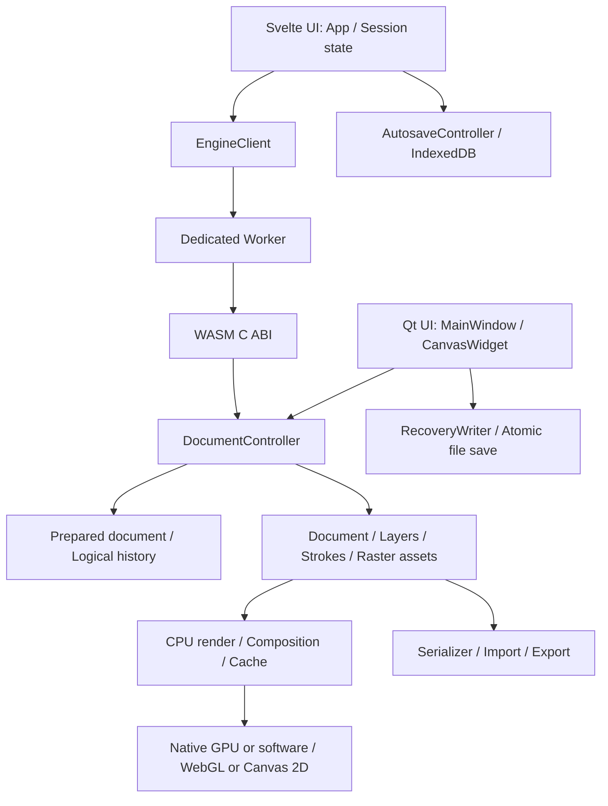
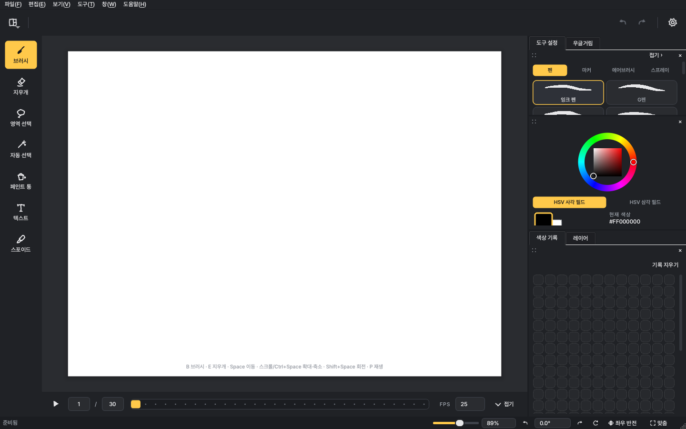
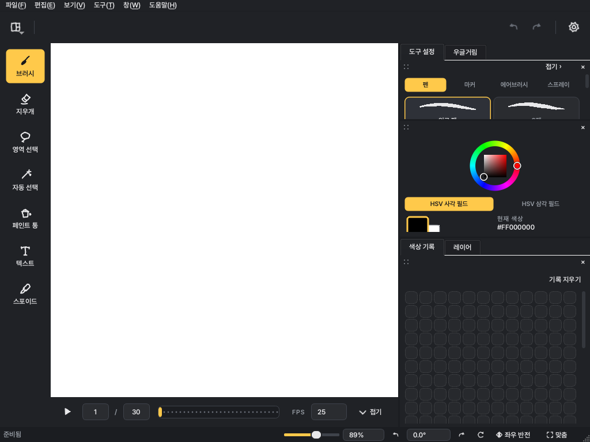

# Ugurugu 종합 검토 보고서

검토일: 2026-09-08 · 대상: **2.2.10**, 커밋 `e883cdd56178725dfcbb83336dbadebd7eb92cbb`

**Ugurugu는 문서·렌더링 엔진과 테스트·배포 체계가 잘 갖춰진 프로젝트다. 다음 개선의 우선순위는 기능 추가보다 저장·복구의 순서 보장, 연속 변환의 정확성, 외부 파일의 메모리 제한, 키보드 접근성이다.** 전체를 다시 작성할 이유는 보이지 않는다. 현재 구조를 유지하면서 문서 세션과 임시 편집의 경계를 명확히 하는 편이 효과적이다.

네이티브 Release 빌드와 **CTest 13개 스위트가 모두 통과**했다. 웹 타입 검사는 오류·경고 0건이며 셸 빌드와 패키지 형식 검사도 통과했다. 그럼에도 기존 테스트가 다루지 않는 저장 큐·문서 교체·제어 키 충돌에서 문제가 재현됐다. 테스트의 양보다 **비동기 작업이 겹치는 순간과 작업 취소·실패 경계**를 보완해야 한다.

이 보고서는 조사와 검증 결과다. 제품 소스·설정은 수정하지 않았으며, 보고서와 검증 자료만 추가했다.

## 1. 검토 범위와 증거 수준

| 대상 | 범위 | 확인 방법 |
| --- | --- | --- |
| 데스크톱 | Qt UI, 입력·선택·텍스트, 문서·히스토리, 렌더링, 파일 입출력, 복구, 업데이트 | 코드와 테스트 대조, 로컬 빌드·CTest, 집중 재현 |
| 웹 | Svelte UI, TypeScript 세션, Worker, WASM C ABI, 저장·복구, 반응형 UI | 정적 검토, 타입·번들 검사, 실제 소스 함수 기반 재현 |
| 품질·운영 | CMake, CI, 퍼징, 커버리지 설정, 패키징, 번역, 문서 | 설정·호출 경로 대조, 일부 로컬 검사 |

보고서의 **실행 확인**은 실제 수행한 검사, **소스 확인**은 호출 경로와 방어 조건까지 읽어 확인한 문제, **개선 제안**은 제품·유지보수 판단이다. 웹 집중 재현은 실제 `App.svelte` 및 컨트롤러 함수를 추출해 실행하되 Worker·IndexedDB·DOM을 최소 대역으로 대체했다. 이를 실제 브라우저/WASM 통합 검증으로 해석하면 안 된다.

이번 환경은 macOS/Apple Silicon, Qt **6.11.2**, AppleClang **21.0.0.21000333**, CMake **4.4.3**, Node **24.20.0**이다. 배포 설정은 Qt **6.11.1**을 고정한다. 따라서 이번 빌드는 배포용 바이너리 자체의 검증을 대신하지 않는다.

실행하지 않은 범위는 Windows 실기기, 펜 태블릿의 실제 입력 지연, Metal/GPU의 실제 화면 표시·드라이버 복구, Safari/Firefox/모바일 브라우저 통합, WASM 전체 브라우저 스위트, 이번 커밋의 ASan·UBSan·퍼징·커버리지 측정, 실제 자동 업데이트·서명 배포다. 로컬에 Qt WASM 키트와 Emscripten 및 엔진 산출물이 없어 웹 전체 실행 검증은 제외했다.

## 2. 프로젝트 구조와 현재 강점

### 2.1 규모와 책임 배치

아래 줄 수는 관련 소스 확장자의 물리적 줄 수이며, 주석·공백을 포함한다. 코드 품질 점수나 테스트 커버리지가 아니다.

| 영역 | 파일 수 | 줄 수 |
| --- | ---: | ---: |
| `src` — C++/Objective-C++ 제품 코드 | 266 | 59,001 |
| `tests` — 네이티브 테스트·지원 코드 | 54 | 29,380 |
| `web/src` — Svelte/TS/CSS | 29 | 8,514 |
| `web/tests` — 브라우저 테스트 | 22 | 2,866 |

공용 코어는 Qt Core/Gui를 사용하지만 Widgets에 의존하지 않도록 타깃을 분리했다. 덕분에 데스크톱과 웹이 문서·렌더링 의미를 공유한다. **코어와 UI의 분리는 이미 잘 되어 있으므로 유지해야 한다.** 근거: [UguruguTargets.cmake](../cmake/UguruguTargets.cmake), [UguruguWasm.cmake](../cmake/UguruguWasm.cmake).

### 2.2 유지할 가치가 큰 설계

| 강점 | 확인한 근거 | 의미 |
| --- | --- | --- |
| 문서 변경의 사전 준비와 트랜잭션 | `DocumentController.cpp`의 prepared state·candidate commit·`MacroTransaction` | 여러 변경 중 실패가 나도 기존 문서를 보존하는 기반이 있다. 텍스트의 여러 획 추가도 단순 QUndoStack 매크로가 아니라 실패 시 폐기 가능한 자체 트랜잭션을 사용한다. |
| 원자적 파일 저장과 복구 세대 관리 | `DocumentSerializer`, `RecoveryStore`, `RecoveryWriter`의 QSaveFile·revision 처리 | 저장 중 실패와 오래된 백그라운드 완료의 영향을 줄인다. 웹 복구에도 이 설계 원칙을 적용할 수 있다. |
| 명시적 자원 제한 | `DocumentLimits.hpp`, `DocumentBudget`, `PreviewMemoryUsage.hpp` | 캔버스·획·점·래스터·클립 마스크·프리뷰 비용을 별도로 관리한다. 발견한 압축 해제 공백을 보완할 기반도 이미 있다. |
| 렌더링 회귀 보호 | golden fixture, composition·mask·coverage·selection·motion 테스트 | 그림 앱에서 중요한 픽셀 결과와 편집 의미를 검사한다. 파일 단순 왕복보다 강한 안전망이다. |
| 작업 취소와 결과 채택 제어 | `RenderEngine.cpp`의 cancellation 전파, Canvas 프리뷰 generation 처리 | 입력 중 불필요한 계산과 낡은 결과 채택을 줄이는 방향이 적절하다. |
| 웹 경계 방어 | ABI 버전 검사, Worker 명령 처리, 레이어 stable ID 재조회 | 웹과 엔진의 버전 불일치 및 대기 중 레이어 인덱스 변화를 고려했다. |
| 번역 완결성 | ko/ja 각각 현재 소스 723개, 신규 누락·미완료·빈 번역·치환자 불일치 0 | 현재 소스에 대해 lupdate와 XML 대조로 확인했다. 문구의 자연스러움까지 사용자 평가한 결과는 아니다. |
| CI와 배포 검증 | 정적 검사, 번역, Windows, sanitizer, fuzz, coverage, WASM parity, browser, package jobs | 개인 프로젝트 규모를 고려할 때 품질 방어가 폭넓다. 테스트가 없거나 CI가 부실한 프로젝트로 평가하는 것은 부정확하다. |
| 공급망 고정 | 외부 C++ 의존성 URL+SHA-256, Actions 커밋 SHA, 배포 Qt 버전 | 재현성과 다운로드 변조 방어에 유리하다. |

## 3. 우선순위별 발견 사항

P1은 다음 안정화 작업에서 먼저 해결할 데이터·문서 정확성 또는 자원 제한 문제다. P2는 사용자 경로·환경에서 발생하는 기능·접근성 문제다. P3는 상대적으로 범위가 제한된 품질 개선이다. 숫자는 실제 발생 빈도나 CVSS를 뜻하지 않는다. 이번 검토에서 P0로 확정한 사항은 없다.

| ID | 우선순위 | 대상 | 핵심 문제 | 증거 |
| --- | --- | --- | --- | --- |
| R01 | P1 | 공용 IO | 압축 헤더 검사만으로 실제 압축 해제 메모리를 제한하지 못함 | 원본 래스터 코드 실행 + Qt 동작 확인 |
| R02 | P1 | 공용/네이티브 변환 | 기존 변환과 새 변환의 합성 순서가 반대인 경로 | 실제 네이티브 선택 이동·회전 + Qt 계산 |
| R03 | P1 | 웹 저장 | 편집 큐보다 저장이 먼저 실행돼 마지막 편집 누락 | 실제 소스 함수 재현 |
| R04 | P1 | 웹 복구 | 이전 문서의 자동저장 완료가 새 문서의 복구 revision을 오염 | 실제 컨트롤러 재현 |
| R05 | P1 | 웹 문서 교체 | 미저장 그림을 새 문서/열기로 교체할 때 보호 절차 없음 | 소스 확인 |
| R06 | P2 | 네이티브 텍스트 | 미적용 텍스트와 문서 교체·저장 경계가 불일치 | 실제 UI·저장·문서 교체 함수 재현 |
| R07 | P2 | 네이티브 내보내기 | 우글거림 ON/OFF에서 WebP 액션 상태 갱신 누락 | 실제 액션 상태 재현 |
| R08 | P2 | 웹 키보드 | 방향키·Enter를 앱 단축키가 가로채 기본 컨트롤 조작 차단 | 실제 shortcut 함수 재현 |
| R09 | P2 | 웹 초기화 | localStorage 접근 차단 시 기본값으로 부팅하지 못함 | 실제 초기화 식 재현 |
| R10 | P2 | 웹 모달 | 포커스 순환·복귀·배경 단축키 차단의 일관성 부족 | 소스 확인 |
| R11 | P2 | 웹 메모리 | 열기 경로가 신규 문서의 크기 정책을 따르지 않음 | 소스 확인, OOM 미측정 |
| R12 | P2 | 네이티브 색상 | 키보드로 새 색을 정밀하게 선택할 대안 부족 | 컨트롤·이벤트 실행 확인 |
| R13 | P3 | 테마 | 일부 사용자 강조색에서 자동 글자색 대비가 낮아짐 | 색 대비 계산 |
| R14 | P2 | 기본 패널 배치 | 빈 색상 기록에 공간이 몰리고 핵심 도구 설정이 숨음 | 두 크기의 offscreen 화면 관찰 |

### R01. 실제 압축 해제 출력량을 제한해야 한다

**근거:** [RasterAssetTable.cpp](../src/io/serializer/RasterAssetTable.cpp) 48–70행, [DocumentJsonCodec.cpp](../src/io/serializer/DocumentJsonCodec.cpp) 566·701·830행.

래스터 코드가 4바이트 압축 헤더와 예상 픽셀 바이트 수를 비교한 뒤 `qUncompress`를 호출한다. 그러나 이 헤더는 출력 버퍼의 초기 크기 힌트일 뿐, 실제 해제량의 상한이 아니다. 크기 불일치 검사는 압축 해제 후 실행되므로 큰 할당을 예방하지 못한다. Qt 공식 문서도 이 의미를 명시한다. [Qt qUncompress 문서](https://doc.qt.io/qt-6/qbytearray.html#qUncompress).

합성 데이터로 확인한 결과, 압축 크기 8,168바이트·선언 크기 4바이트인 입력이 실제로는 8,388,608바이트로 풀렸다. 원본 `RasterAssetTable.cpp`를 링크해 decoded budget을 4바이트로 설정해도 최종 `Invalid` 반환 전에 해제가 진행됐으며, 한 번의 측정에서 프로세스 최대 RSS가 약 10.19MiB 증가했다. RSS 증가에는 할당 부수 비용이 포함되므로 이를 정확한 함수별 메모리 사용량으로 해석하지 않는다.

**영향:** 외부 문서·클립보드의 압축 데이터를 처리할 때 앱의 메모리 예산을 넘는 일시 할당과 응답 정지/메모리 고갈 가능성이 있다. 실제 OOM이나 코드 실행은 재현하지 않았으며, 원격 코드 실행 취약점으로 주장하지 않는다.

**개선:** 압축 해제 중 실제 출력 바이트를 제한하는 공용 decoder를 만들고 래스터·마스크 경로에 적용한다. 예상 크기·문서 누적 예산을 넘는 즉시 중단하고, 잘못된 스트림·출력 부족·초과를 일관되게 거절한다. 기존 사후 길이 검증도 유지한다.

**완료 기준:** 헤더와 실제 해제량이 다른 입력에서 출력 상한을 넘기기 전에 거절하고, 기존 정상 프로젝트·클립보드 왕복 결과가 동일해야 한다. 퍼저에 구조를 유지한 압축 입력 corpus를 추가한다. 증거: [래스터 예산 재현 결과](review-evidence-2026-09-08/raster-budget-probe.log).

### R02. 변환 합성을 문서 좌표계 기준으로 통일해야 한다

**근거:** [DocumentControllerStrokes.cpp](../src/document/DocumentControllerStrokes.cpp) 547·867행, [CanvasWidget.cpp](../src/ui/CanvasWidget.cpp) 509·539행.

이미지 변환이 있는 획을 복제·변환하는 일부 경로는 `새 변환 * 기존 변환`을 저장한다. 공용 컨트롤러에서 이 문제는 **selectionMask가 없는 경로**에 해당한다. 마스크가 있는 선택은 별도 `PixelSelectionOp` 경로이므로 모든 선택 편집이 같은 방식으로 잘못된다고 확대하면 안 된다. 네이티브 선택 세션의 scale/rotate에도 같은 합성 순서가 있다.

Qt QTransform은 점에 적용되는 순서대로 곱을 배치한다. 문서 좌표계에서 기존 결과에 새 이동·회전·확대를 적용하려면 기존 변환 뒤에 새 변환이 와야 한다. [Qt Combining Transforms](https://doc.qt.io/qt-6/qtransform.html#combining-transforms).

작은 Qt 실행 예에서 기존 변환은 이동 `(10,20)`과 2배 확대, 새 변환은 이동 `(3,4)`, 원점 근처의 검사점은 `(1,1)`이다. 새 이동을 기존 결과에 적용한 기대값은 `(15,26)`인데 현재 곱 순서는 `(18,30)`을 만든다. 첫 변환이 identity인 경우나 이동만 반복하는 경우에는 드러나지 않아 단일 단계 테스트로 놓치기 쉽다.

네이티브 Release 라이브러리를 이용한 추가 재현에서는 256×256 문서의 사각 선택을 실제 `beginSelectionMove → continueSelectionMove → commitSelectionMove`로 `(20,10)` 이동한 뒤 `rotateSelection(90)`을 호출했다. 선택 중심이 **`(110,100) → (140,90)`**으로 바뀌었다. 중심 기준 회전에서 유지돼야 할 위치가 30px/-10px 이동한 것이다. 따라서 일반 마스크 선택에서도 CanvasWidget의 누적 변환 문제는 실제로 발생한다. 초기 선택 마스크는 테스트 접근자로 준비했으며 마우스 드래그부터 시작하는 전체 사용자 시나리오는 아니다. [네이티브 집중 재현 로그](review-evidence-2026-09-08/probe.log).

**개선:** 각 변환이 원본 이미지·레이어·문서·화면 중 어느 좌표계인지 명시하고 공용 합성 함수로 모은다. 단순히 저장된 모든 행렬 순서를 일괄 바꾸지 말고, 사용자 입력 delta를 합성하는 지점부터 수정한다.

**완료 기준:** 이동→회전, 이동→확대, 비균일 확대→이동, 뒤집기→회전, 적용→undo/redo의 결과를 독립적인 기대 좌표와 비교한다. 선택 중심 보존, 클립 마스크 정렬, 화면 미리보기와 커밋 결과의 픽셀 일치도 확인한다. 증거: [Qt 계산 결과](review-evidence-2026-09-08/qt-transform-and-decompression.log).

### R03. 저장은 편집 큐의 완료를 보장해야 한다

**근거:** [App.svelte](../web/src/App.svelte) 275행의 `enqueue`, 129–134행의 자동저장 host, 1529–1535행의 `downloadDocument`.

편집은 Promise 큐를 사용하지만 수동 저장은 큐 밖에서 즉시 `engine.serialize()`를 호출한다. 느린 렌더 뒤에 획 완료가 대기 중일 때 저장하면 직렬화가 먼저 Worker에 전달될 수 있다.

실제 소스 함수 기반 재현 순서는 `serialize committed=0 → downloaded value=0 → strokeEnd committed=1`이었다. 사용자는 저장을 완료했다고 생각하지만 파일에는 마지막 편집이 빠질 수 있다.

**개선:** 저장을 편집과 같은 큐에 넣고 입력 중인 획·미적용 변형의 처리 정책을 먼저 적용한다. 단순 `await chain`보다 저장 명령 자체를 세션 큐에 넣어 뒤따르는 교체 작업과도 순서를 보장하는 편이 명확하다. 문서 identity·이름·저장 revision도 명령에 함께 캡처한다. 자동저장 직렬화도 동일한 경계를 사용한다.

**완료 기준:** 느린 엔진에서 pen-up 직후 저장, undo 직후 저장, 레이어 변경 직후 저장, 저장 직후 다른 문서 열기를 실행해 다운로드한 파일을 다시 열었을 때 사용자 의도한 마지막 상태와 일치해야 한다.

### R04. 웹 복구에는 문서 세대 식별자가 필요하다

**근거:** [AutosaveController.svelte.ts](../web/src/lib/AutosaveController.svelte.ts) 36–37·49–69행, [App.svelte](../web/src/App.svelte) 531–536행.

`reset()`은 savedRevision만 0으로 바꾼다. 이미 실행 중인 이전 문서 snapshot은 IndexedDB 쓰기가 끝난 뒤 이전 revision을 다시 기록할 수 있다.

재현은 A의 revision 1 저장 완료를 지연하고, B로 교체/reset한 다음 A 저장을 완료시키는 순서다. B의 첫 편집도 revision 1이 되면 savedRevision과 같아 다음 snapshot을 건너뛴다. 재현 결과 B는 저장되지 않고 A의 복구 기록 한 건만 남았다. 단순 revision 번호는 문서마다 재사용되므로 문서의 동일성을 대신할 수 없다.

**개선:** 세션 ID/generation을 캡처하고 모든 await 이후 유효성을 검사한다. 이전 완료는 새 문서의 savedRevision·상태 메시지를 갱신할 수 없어야 한다. 저장소도 문서별 키나 현재 세대의 채택 규칙을 사용해 오래된 write가 현재 복구본을 대체하지 않도록 한다.

**완료 기준:** serialize 지연·IDB 지연 각각에 대해 문서 교체, 복구 폐기, 연속 새 문서 만들기를 섞어 검증한다. 새 문서의 첫 편집이 항상 복구 가능해야 한다.

### R05. 웹의 새 문서·열기는 미저장 작업을 보호해야 한다

**근거:** [App.svelte](../web/src/App.svelte) 565–610행, [engine-worker.js](../web/public/engine/engine-worker.js) 162–180행, [RecoveryStore.ts](../web/src/lib/RecoveryStore.ts) 7–9·82행.

다른 파일을 열거나 새 문서를 만들 때 dirty 확인, 저장 여부 선택, 기존 문서의 복구 완료 대기가 없다. 새 handle 생성에 성공하면 이전 handle을 삭제한다. 기본 복구 간격은 15초이므로 첫 자동저장 전에 바꾸면 직전 그림을 잃을 수 있다. 복구 저장소도 하나의 슬롯이어서 이후의 snapshot이 이전 문서를 대체한다.

같은 origin의 여러 탭도 이 슬롯을 공유한다. 탭별 namespace나 조정이 없어 다른 탭의 복구 기록을 대체할 수 있다는 운영 제한도 함께 정의해야 한다.

깨진 파일 열기가 현재 문서를 보존하도록 한 방어는 좋은 설계다. 다만 **정상 파일을 열 때 의도치 않게 기존 작업을 잃는 경로**는 별개의 문제다.

**개선:** 수동 저장 기준의 dirty 상태를 도입하고 문서 교체 전 저장/계속 편집/버리기 선택을 제공한다. 브라우저 다운로드 완료와 실제 디스크 보존을 완전히 같은 의미로 취급하지 않도록 문구도 설계한다. 문서별 복구 이력을 함께 제공하면 새로고침·탭 종료에도 더 강하다.

**완료 기준:** 그림을 그리고 15초 이내 다른 문서로 이동해도 사용자가 명시적으로 버리지 않은 내용은 보존되어야 한다. 기존 브라우저 New 시나리오에도 이전 문서 보존 검사를 추가한다.

### R06. 미적용 텍스트를 문서 전환 경계에서 처리해야 한다

**근거:** [CanvasWidget.cpp](../src/ui/CanvasWidget.cpp) 95–107·1613–1636행, [CanvasWidgetText.cpp](../src/ui/CanvasWidgetText.cpp), [MainWindow.cpp](../src/ui/MainWindow.cpp) 823–826·932행.

문서 교체 시 `cancelActiveInteraction()`이 텍스트 드래그는 끝내지만 텍스트 배치 상태 자체를 취소하지 않는다. 또한 미적용 텍스트는 `hasUnsavedWork()`의 판단 및 저장 문서에 포함되지 않는다. 화면에 보이는 텍스트, 문서 소속, 저장 여부의 의미가 어긋날 수 있다.

실제 UI 함수 재현에서 텍스트 배치가 활성인데 `unsaved=0`이었다. 저장 성공 후 문서는 획 0개이고 미리보기는 남았다. 공용 컨트롤러로 새 문서를 만든 뒤에도 배치가 살아 있었으며, 이를 적용하자 새 문서에 **22개 획**이 생성됐다. 파일 저장창·New 메뉴 클릭 전체 대신 실제 저장 함수와 문서 교체 신호 경로를 호출한 결과다.

**개선:** 텍스트·선택 변형·입력 중 획을 포함하는 임시 편집 정책을 만들고 저장/내보내기/새 문서/열기/닫기에서 적용 또는 취소·안내를 통일한다. 텍스트 문자열과 폰트 설정을 다음 문서에서 재사용하는 것과, 이전 캔버스의 미적용 배치를 유지하는 것은 별도 상태로 다룬다.

**완료 기준:** A 문서에 텍스트를 배치한 뒤 미적용 상태에서 저장·열기·새 문서·닫기를 각각 수행한다. 이전 배치가 B 문서에 남거나, 보이는 내용이 안내 없이 저장에서 빠지지 않아야 한다. 여러 glyph 추가 중 예산 초과의 부분 커밋 문제는 자체 `MacroTransaction` 방어를 확인해 발견 목록에서 제외했다.

### R07. WebP 내보내기 액션을 공통 상태 계산에 포함해야 한다

**근거:** [MainWindow.cpp](../src/ui/MainWindow.cpp) 1570–1588행, [MainWindowExport.cpp](../src/ui/MainWindowExport.cpp) 245–252행.

`applyWobbleAnimationEnabled()`는 GIF와 PNG 액션은 갱신하지만 WebP는 갱신하지 않는다. 반면 `updateExportActions()`는 GIF와 WebP를 함께 처리한다. 이 때문에 우글거림을 끌 때 GIF만 비활성화되거나, 내보내기 완료 후 다시 켤 때 WebP가 비활성 상태로 남는 등 같은 기능군의 상태가 달라질 수 있다.

실제 액션 상태는 초기 `GIF=1/WebP=1`, OFF 후 `GIF=0/WebP=1`, 공통 export 상태 갱신 후 ON에서 `GIF=1/WebP=0`이었다. 두 번째 경로는 인코딩 전체 대신 export 완료가 호출하는 상태 갱신 함수를 직접 실행해 확인했다.

**개선:** 우글거림 설정·내보내기 busy 변화가 모두 하나의 액션 상태 계산 함수를 호출하게 한다. 지원 여부 판단을 여러 이벤트 핸들러에 복제하지 않는다.

**완료 기준:** ON→OFF→ON, OFF 상태 이미지 내보내기→ON, 작업 중 토글의 순서에서 GIF/WebP/정지 이미지 메뉴가 일관돼야 한다.

### R08. 앱 단축키보다 컨트롤 기본 키 동작을 먼저 보존해야 한다

**근거:** [Shortcuts.ts](../web/src/lib/Shortcuts.ts) 45–53·179–187행, [App.svelte](../web/src/App.svelte) 1661–1662행.

range input은 text entry가 아니라고 분류되어 방향키가 앱의 프레임 이동으로 넘어간다. 버튼의 Enter도 재생 전환으로 처리된다. App이 처리된 키에 `preventDefault()`를 호출하므로 기본 슬라이더 값 변경이나 버튼 실행이 차단된다. 실제 shortcut 함수에서 range ArrowRight→`stepFrame(1)`, button Enter→`togglePlayback`을 재현했다.

**개선:** range의 방향키/Home/End, 버튼의 Enter/Space 등 컨트롤 고유 키는 먼저 반환한다. Ctrl/Cmd+Z처럼 필요한 앱 명령은 별도로 허용한다. 선택 변형의 Enter/Escape도 캔버스 및 해당 세션에서만 처리한다.

**완료 기준:** Tab으로 모든 일반 컨트롤에 접근하고 마우스 없이 값 변경·실행을 완료할 수 있어야 한다. 자유형 드로잉 자체와 주변 UI의 키보드 조작은 구분해서 평가한다. [W3C Keyboard 기준 설명](https://www.w3.org/WAI/WCAG22/Understanding/keyboard.html).

### R09. 저장소 접근 실패 시에도 셸이 열려야 한다

**근거:** [App.svelte](../web/src/App.svelte) 119–122행. 같은 파일 215–230행과 `ToolSettings.ts`에는 이미 안전한 읽기 처리가 있다.

초기 `animateWhileDrawing` 값은 try/catch 없이 `window.localStorage.getItem()`을 호출한다. 저장소를 제한한 환경에서 SecurityError가 발생하면 설정 기본값으로 진행하지 못하고 셸 초기화가 중단될 수 있다. 실제 초기화 식에 실패하는 저장소 접근을 넣어 uncaught 예외를 확인했다.

**개선:** 안전한 preference reader/writer를 공유하고 실패하면 기본값과 세션 내 설정을 사용한다. 저장소가 막혔다는 안내와 앱 사용 자체의 가능 여부를 분리한다.

**완료 기준:** localStorage getter/getItem/setItem, IndexedDB open/write를 각각 실패시켜도 새 문서와 다운로드 저장을 사용할 수 있어야 한다. 현재 IndexedDB 실패 시나리오만으로는 이 경로를 검증하지 못한다.

### R10. 모달과 모바일 시트의 포커스 규칙을 통일해야 한다

**근거:** [NewDocumentDialog.svelte](../web/src/lib/NewDocumentDialog.svelte) 38–53행, [NoticesDialog.svelte](../web/src/lib/NoticesDialog.svelte) 21–25행, [DocumentSizeDialog.svelte](../web/src/lib/DocumentSizeDialog.svelte) 62–72행, [Sheet.svelte](../web/src/lib/Sheet.svelte) 21–64행, [App.svelte](../web/src/App.svelte) 1596–1605행.

일부 대화상자는 처음 focus만 이동하고 Tab 순환·닫은 뒤 호출 버튼 복귀가 없다. DocumentSize는 초기 focus 이동도 없으며 App의 전역 키 차단 조건에서 제외된다. Sheet는 `aria-modal=true`이지만 dock를 계속 사용할 수 있도록 구현되어 의미와 행동이 일치하지 않는다.

**개선:** 공용 dialog 구현으로 focus·Escape·복귀·배경 비활성화를 통합한다. 모바일 시트는 실제로 배경 조작을 허용할 것인지 먼저 정하고 modal 의미를 맞춘다.

**완료 기준:** 열기→Tab/Shift+Tab→Escape→호출 버튼 복귀가 일관되고, 문서 크기 대화상자 뒤의 그림이 단축키로 바뀌지 않아야 한다. 실제 스크린리더 낭독은 별도 실기기 검증 항목이다.

### R11. 웹의 파일 열기도 해제 후 메모리 비용을 검사해야 한다

**근거:** [MemoryPolicy.ts](../web/src/lib/MemoryPolicy.ts) 21–38·73행, [App.svelte](../web/src/App.svelte) 568·1525행, [EngineBridge.cpp](../src/wasm/EngineBridge.cpp) 85–104행, [DocumentLimits.hpp](../src/document/DocumentLimits.hpp) 14행.

신규·resize의 웹 최대 변은 desktop 2048/mobile 1024이지만 열기는 파일 바이트 수만 검사한다. 공용 serializer는 4096까지 허용하므로 작은 파일 크기의 큰 캔버스가 더 낮은 웹 제한을 거치지 않고 채택될 수 있다. 4096² RGBA 표면 하나만으로 64MiB이며 추가 이미지·텍스처·임시 렌더가 함께 존재한다. 또한 `file.arrayBuffer()`를 먼저 실행해 파일 전체를 읽은 뒤 64MiB 제한을 검사한다.

**개선:** 읽기 전에 `File.size`를 검사하고, 문서 채택 전에 캔버스 크기·decoded raster·mask·예상 표면 비용을 검사한다. 기존 큰 문서 열기를 의도적으로 허용한다면 별도의 import 정책과 다운스케일 제안을 명시한다. WASM 512MB 최대 heap 설정은 브라우저 전체 메모리를 제한하지 않는다.

**완료 기준:** 모바일 프로파일에서 최대 변 초과·작은 압축 크기의 큰 문서·읽기 제한 초과 파일을 명시적인 안내와 함께 처리해야 한다. 이번에는 실제 모바일 OOM을 측정하지 않았으므로 성능 수치나 크래시 빈도를 추정하지 않는다.

### R12. 색상 선택에 정밀 입력과 키보드 대안을 제공해야 한다

**근거:** [ColorWheel.cpp](../src/ui/ColorWheel.cpp) 96–104·479–534행, [ColorDock.cpp](../src/ui/ColorDock.cpp) 68–78행, [ColorPairSwatch.cpp](../src/ui/ColorPairSwatch.cpp) 19·60–74행.

색상 wheel과 전경/배경 교환은 ClickFocus·마우스 중심이며, HEX 표시는 선택 가능한 QLabel이다. 화면에 있는 값을 복사할 수는 있어도 원하는 색상 코드를 입력하는 일반적인 경로가 없다. 키보드 사용자뿐 아니라 브랜드색·반복 색상 작업에도 불편하다.

실제 ColorWheel에서 TabFocus 없음, ArrowRight 입력 후 색상 변화 없음, accessibleName 공백을 확인했다. 접근성 이름은 Qt/OS의 다른 정보로 보완될 수 있으므로 이 결과만으로 모든 스크린리더 낭독이 불가능하다고 단정하지 않는다.

**개선:** 검증 가능한 HEX/RGB 입력, 명시적인 전경/배경 교환 액션, 색상 제어의 accessible name·값·키보드 조작을 제공한다. 색 기록을 재선택하는 기능과 새로운 색을 생성하는 기능은 분리해서 확인한다.

**완료 기준:** 마우스 없이 임의의 HEX 색을 입력하고 실제 브러시 색·화면 표시·저장 후 재열기 결과를 확인할 수 있어야 한다.

### R13. 사용자 강조색의 글자색은 실제 대비로 선택해야 한다

**근거:** [Theme.cpp](../src/ui/Theme.cpp) 135–141행.

현재 raw RGB 가중치로 밝기를 계산해 흑백 중 하나를 선택한다. sRGB 선형화를 적용한 실제 대비와 다르다. 예를 들어 강조색 `#00B900`에는 밝은 글자 `#FAFAFB`가 선택되어 약 **2.54:1**이지만 어두운 후보 `#18181A`는 약 **6.70:1**이다. 기본 강조색 `#FFC94A`의 대비는 약 **11.57:1**로 양호하다.

**개선:** 각 후보의 실제 상대 휘도 대비를 계산해 더 높은 쪽을 고르고 hover/pressed 상태도 함께 확인한다. 일반 텍스트 4.5:1은 데스크톱 UI의 참고 기준으로 사용할 수 있다. 이 사례만으로 앱 전체의 WCAG 준수 여부를 판단하지 않는다. [W3C Contrast Minimum](https://www.w3.org/WAI/WCAG22/Understanding/contrast-minimum.html).

### R14. 기본 패널 높이를 작업 빈도와 실제 내용에 맞춰야 한다

**근거:** [MainWindow.cpp](../src/ui/MainWindow.cpp) 801–820행의 기본 dock 배치, [ColorHistoryGrid.cpp](../src/ui/ColorHistoryGrid.cpp) 23·49–65·107–110행의 256개 슬롯과 행 높이.

격리한 기본 설정으로 1440×900과 1024×768 화면을 렌더링했다. 큰 화면에서도 우측 도구 설정은 프리셋 일부만 보이고 크기·필압·보정에 접근하려면 스크롤해야 했다. 작은 화면에서는 프리셋 첫 줄의 라벨과 전경/배경 색상 표시 하단이 잘렸다. 반면 빈 색상 기록이 여러 줄로 펼쳐져 큰 공간을 차지했고 레이어 목록은 뒤쪽 탭에 있었다.

**개선:** 빈 색상 기록은 1–2줄 또는 간결한 빈 상태로 시작하고 실제 기록 수에 따라 확장한다. 기본 탭의 레이어 우선 노출을 검토하고, 브러시 크기 등 자주 쓰는 설정은 프리셋 스크롤과 분리한다. 패널을 이동할 수 있는 기능은 유지하되 사용자가 첫 실행부터 배치를 고칠 필요를 줄인다.

**관찰 한계:** Qt 6.11.2/Fusion/offscreen, 한국어와 PretendardJP를 적용한 실행 화면이다. 테스트용 창이며 Cocoa/Windows 네이티브 창 관리자의 실제 배치·고배율 조합은 추가 확인해야 한다. 축소 캡처에서는 캔버스 fit을 다시 실행하지 않았으므로 캔버스의 흰 영역 크기는 반응형 결함 근거로 사용하지 않았다.

1440×900 기본 배치:

1024×768 기본 배치:

## 4. UI/UX 종합 평가와 개선 방향

### 4.1 처음 시작하기와 기능 발견

README의 새 캔버스→그리기→우글거림→내보내기 흐름과 F1 도움말은 앱의 목적을 잘 설명한다. 브러시 프리셋, 접을 수 있는 패널, 레이아웃 초기화, 단축키 변경도 숙련 사용자에게 도움이 된다. 다만 기능이 늘면서 텍스트·선택 변형·레이어 범위·재생 상태 등 여러 모드가 동시에 존재한다.

첫 사용 흐름에서는 작은 예제와 함께 **그리기, 움직임 조절, 공유**의 세 단계만 우선 노출하고, 고급 파라미터는 펼쳐서 볼 수 있게 하는 방향을 권한다. 이미 제공되는 기능을 더 추가하기보다 현재 모드, 적용 대상, 임시 상태를 눈에 띄게 표시하는 것이 우선이다. 실제 신규 사용자 과업 테스트를 수행한 결과는 아니므로 탐색 시간·성공률을 측정해 검증해야 한다.

### 4.2 화면과 저장 결과의 일치

가장 중요한 UX 원칙은 **화면에 보이는 내용 중 무엇이 저장되는지 사용자가 알 수 있는 것**이다. R03–R06은 서로 다른 구현 문제지만 사용자에게는 모두 “그렸는데 저장 결과가 다르다”로 보인다.

| 사용자 상황 | 권장 동작 |
| --- | --- |
| 획이 아직 처리 중인데 저장 | 입력을 안전하게 마무리하고 해당 revision까지 반영한 뒤 저장 |
| 미적용 텍스트·변형이 있는 상태 | 적용/취소 상태를 표시하고 저장·내보내기 전 동일한 정책 적용 |
| 다른 문서로 전환 | 미저장 상태 표시, 저장/버리기/계속 편집 또는 문서별 복구 보존 |
| 자동 복구 실패 | 지속적으로 보이는 짧은 안내와 다운로드 저장 행동 제공 |
| 작업은 복구됐지만 파일 저장은 안 됨 | “복구본 있음”과 “파일 저장됨”을 별도 상태로 표시 |

웹 상태·오류는 일반 `
`에 표시되는 경로가 있다(`App.svelte` 2154–2162행). 복구 실패는 쉽게 사라지는 진행 메시지와 분리하고, 보조기술에는 적절한 live region으로 전달하는 편이 좋다.

### 4.3 편집 규칙과 작업 모델

네이티브 Copy가 클립보드 복사와 동시에 새 레이어를 만드는 동작은 기존 테스트에 명시된 의도이므로 버그로 분류하지 않았다. 다만 일반적인 Copy에 익숙한 사용자는 레이어가 늘어나는 이유를 이해하기 어렵다. 현 동작을 유지한다면 명칭·설명에서 결과를 예고하거나, Copy와 Duplicate to New Layer를 별도 액션으로 제시하는 선택지를 검토할 수 있다.

레이어 이름 변경의 웹 경로는 double-click과 `window.prompt` 중심이다(`LayerPanel.svelte` 65–69·161–166행). 이름 변경 메뉴/F2/인라인 편집을 제공하면 키보드와 터치 모두에서 발견성이 좋아진다. 레이어 이동·그룹·참조·불투명도·합성 모드는 행 전체의 정보 위계를 먼저 정리하고 색이나 아이콘에만 의미를 맡기지 않는 것이 좋다.

### 4.4 반응형·접근성

웹의 전폭 캔버스 + 하단 dock + sheet는 모바일 공간 사용에 적합하며 breakpoint에서 캔버스를 다시 만들지 않는 설계도 좋다. 패널 내부 컨트롤은 데스크톱 치수가 남아 있다. 예를 들어 레이어 reference 버튼 폭은 1.35rem, 색상 입력은 1.8×1.4rem이다. rem의 실제 크기와 주변 간격을 실측한 뒤 터치 영역을 조정해야 한다.

내부 UX 목표로 자주 쓰는 터치 컨트롤에 44px 수준의 여유 있는 영역을 권한다. 이를 모든 컨트롤의 WCAG AA 필수값으로 표현하면 부정확하다. WCAG 2.2의 최소 타깃 기준은 원칙적으로 24×24 CSS px이며 간격·동등 제어 등 예외가 있다. [W3C Target Size Minimum](https://www.w3.org/WAI/WCAG22/Understanding/target-size-minimum.html).

키보드 단축키가 많다는 사실만으로 접근성이 완성되지 않는다. R08·R10·R12 수정 후 Tab 순서, focus 표시, 현재 값 낭독, 레이어 조작, 확대 글꼴·고배율 화면, 모바일 가로 방향을 함께 검증해야 한다.

## 5. 코드 품질과 유지보수

### 5.1 거대 파일보다 공유 상태의 소유권이 문제다

| 파일 | 줄 수 | 다음 분리 기준 |
| --- | ---: | --- |
| `web/src/App.svelte` | 2,601 | 문서 세션·명령 큐·복구 generation을 함께 소유하는 객체 |
| `src/document/DocumentController.cpp` | 1,740 | 트랜잭션·history·교체 준비의 불변조건을 명시한 경계 |
| `src/io/serializer/DocumentJsonCodec.cpp` | 1,715 | 구조 검증과 제한된 binary/raster/mask decode 서비스 |
| `src/ui/CanvasWidget.cpp` | 1,641 | 입력·선택·텍스트 세션과 문서 경계 처리 |
| `src/ui/MainWindow.cpp` | 1,626 | 저장/복구 lifecycle과 액션 상태 계산 |
| `src/ui/CanvasWidgetPreview.cpp` | 1,525 | 프리뷰 job·완료 채택·표면 예산 관리 |

파일 길이만으로 품질이 나쁘다고 결론 낼 수 없다. 이미 기능별 `.cpp` 분리가 있으며 코어 방어도 강하다. 다만 App과 Canvas가 많은 가변 상태를 공유하면서 저장·교체·단축키의 누락이 발생하고 있으므로, **상태와 그 상태를 변경하는 연산을 함께 옮기는 리팩터링**이 필요하다.

권장 순서는 웹 `DocumentSession`에 identity/revision/queue/dirty/save/replace를 모으고, 그 다음 `SelectionSession`과 `InputSession`을 분리하는 것이다. 네이티브도 동일한 이름을 억지로 적용하기보다 임시 편집의 시작·적용·취소·문서 교체 규칙을 한곳에 모으면 된다. 테스트를 먼저 추가하고 한 경계씩 옮긴다.

### 5.2 계약과 중복 상태 계산

WebP 액션 누락은 상태 계산이 두 곳에 나뉜 결과다. `canExportAnimation`, `canSave`, `hasPendingEdit`처럼 사용 가능 여부를 명시적으로 계산하고 UI에서 소비하게 하면 누락을 줄일 수 있다.

웹의 TypeScript EngineClient, Worker JS dispatch, C++ C ABI는 수작업으로 대응한다. ABI 버전 확인은 유지하고, 명령 schema·응답 타입·오류 코드를 공유하거나 생성하는 방식을 검토한다. 전면 코드 생성보다 자주 바뀌는 문서 상태·레이어 명령부터 좁게 적용하는 것이 적절하다.

문서 좌표와 화면 좌표, 원본 이미지 좌표의 구별은 함수 이름·매개변수·주석에서 드러나야 한다. R02처럼 기본 자료형이 같아 컴파일러가 잡지 못하는 실수를 줄이는 데 효과적이다.

### 5.3 오류와 진단

네이티브의 회전 로그, 복구 실패 표시, 입력 장치 기록은 문제 재현에 유용하다. 웹도 사용자가 복사할 수 있는 진단 정보에 앱/ABI 버전, 브라우저, 메모리 프로파일, 마지막 성공 revision, 렌더러 종류를 제공하면 지원 부담을 줄일 수 있다. 문서 내용이나 로컬 경로를 기본 수집하는 방식은 필요하지 않다.

## 6. 성능·메모리 평가

성능 문제가 모든 그림에서 발생한다고 판단할 자료는 없다. 기존 문서의 측정값은 당시 조건의 결과이며 이번 환경에서 재측정한 값이 아니다. [drawing-performance-follow-up.md](drawing-performance-follow-up.md)의 성공한 획 후 중복 warmup 제거 및 RenderEngine 취소 전파는 현재 코드에 반영되어 있어 신규 미구현 항목으로 세지 않았다.

다음 측정의 우선순위는 명확하다.

| 영역 | 근거/가설 | 측정 항목 | 개선 판단 기준 |
| --- | --- | --- | --- |
| UI thread의 전체 이미지 복사 | `CanvasWidgetPreview.cpp` 1390행 등 regional 완료 후 base copy | callback p50/p95/max, 복사 바이트, 입력 이벤트 대기 | 복사가 입력 지연을 지배할 때 worker에서 완성 이미지를 만들고 UI는 채택만 수행 |
| 백그라운드 작업 경쟁 | frame cache·interaction·복구 직렬화의 동시 실행 | UI CPU·process CPU·동시 worker·peak RSS·재생 재개 시간 | 실제 입력 지연이 나빠질 때 우선순위·가변 동시성 도입 |
| 웹 첫 획·undo 후 첫 획 | 기존 웹 진행 문서에 전체 렌더 비용이 기록됨 | cold/warm 입력 시작·커밋 지연, 문서 크기·획 밀도 | 프리뷰 준비가 줄이는 지연과 늘리는 메모리를 함께 평가 |
| 웹 GIF export | render+encode가 한 Worker를 점유 | 프레임 수별 시간, UI 응답, 취소 지연, peak memory | 프레임 단위 작업 분할·진행률·취소 도입 |
| 복구 snapshot | 큰 문서 serialize가 엔진 큐를 점유 | snapshot 시간·큐 대기·미복구 시간 | 입력 idle 우선 처리, 저장 순서 보장, 누적 지연 상한 |

재현 가능한 native 성능 도구를 `tools/`에 두고 조건과 JSON 결과를 남기는 것이 우선이다. 문제 문서와 빈 문서, 회전 0/5도, software/GPU, 우글거림 ON/OFF, immediate/idle을 구분하고 최소 반복 수·열 상태·실패 조건을 기록한다. 사용자 문서는 저장소에 넣기보다 경로와 해시로 식별한다.

GPU로 렌더러를 전면 이관하는 작업은 현재 근거로 우선 권하지 않는다. 문서·히스토리·직렬화 비용은 그대로이고 픽셀 동등성과 fallback 유지 비용이 커진다. 실제 프로파일에서 upload·합성이 지배적일 때 해당 구간만 검토한다.

## 7. 테스트와 배포·운영

### 7.1 이번 검증 결과

| 검사 | 이번 결과 | 해석 |
| --- | --- | --- |
| `cmake --preset macos-release -DUGURUGU_WARNINGS_AS_ERRORS=ON` | 성공 | 로컬 Qt 6.11.2 개발 검증 환경 |
| `cmake --build --preset macos-release --parallel 6` | 성공, 339 build steps | 제품 코드와 테스트 링크 완료 |
| `ctest --preset macos-release --parallel 4 --output-on-failure` | **13/13 통과**, 38.19초 | offscreen 스위트 수이며 개별 test case 수가 아님 |
| 다운로드 badge Node 테스트 | **4/4 통과** | 집계 로직 검사 |
| `npm run check` | **오류 0 / 경고 0** | Svelte/TypeScript 정적 검사 |
| `npm run build` | 성공 | 엔진이 없는 셸 빌드. 실제 문서 로딩은 불가능 |
| itch.io 패키지 규칙 검사 | 성공, 12파일·0.79MiB | 파일 수·크기·경로 형식 검사. 완전한 앱 크기가 아님 |
| 웹 비동기/입력 집중 재현 | 4개 문제 확인 | 실제 소스 함수 + 최소 대역, 통합 브라우저 테스트 아님 |
| Qt 변환/래스터 제한 집중 재현 | 기대와 다른 계산·사후 거절 전 해제 확인 | 원본 함수/Qt 동작 범위 |
| 네이티브 UI 집중 재현 | 선택 중심 이동, 텍스트 경계, WebP 상태, 색상 키보드 문제 확인 | Release 라이브러리 + 테스트 접근자, 격리한 offscreen 실행 |
| 네이티브 화면 검토 | 1440×900 / 1024×768 캡처 확인 | 기본 패널 관찰, 실제 Cocoa/Windows GPU 검증 아님 |
| ko/ja lupdate 및 XML 대조 | 각 723/723, 누락·치환자 오류 0 | 현재 소스 기준 번역 완결성 |

웹 산출물의 JS는 133.36kB, gzip 45.88kB였지만 WASM을 포함하지 않는다. 폰트는 584.60kB다. 이 수치만으로 전체 앱의 초기 로딩 성능을 평가해서는 안 된다.

### 7.2 기존 CI를 보완할 지점

CI에는 Clang-Tidy·포맷·번역·ASan/UBSan·네 종류 파서 퍼징·Windows·WASM parity·Chromium 시나리오·패키지 검사가 이미 있다. 커버리지 job은 전체 line coverage **70% 하한을 설정**한다. 이번 검토에서 현재 실제 커버리지 비율을 측정하지 않았으므로 “70% 이상 확보했다”는 실행 결과로 쓰지 않는다. 근거: [ci.yml](../.github/workflows/ci.yml).

| 추가할 회귀 테스트 | 현재 빈틈 | 우선순위 |
| --- | --- | --- |
| 느린 명령 큐에서 즉시 저장·재열기 | 기존 recovery 테스트는 반영 완료를 기다림 | P1 |
| IDB 완료 중 문서 교체·복구 폐기 | revision만 같고 문서가 다른 상황 | P1 |
| 작업 직후 새 문서·다른 파일 열기 | 정상 교체 후 이전 작업 보존 여부 | P1 |
| 압축 헤더·실제 해제량 불일치 | 사전 헤더 검사 통과 후 할당 | P1 |
| 2개 이상 비가환 변환 조합 | identity/한 번의 변환만으로는 순서 오류가 드러나지 않음 | P1 |
| pending text 저장·교체·닫기 | TextStrokeBuilder 단위 검사와 UI lifecycle은 별개 | P2 |
| 슬라이더/버튼 focus 상태의 키 입력 | 앱 단축키만 검사하면 기본 동작 훼손을 놓침 | P2 |
| localStorage 차단 + IDB 실패 구분 | 저장소별 실패 방식이 다름 | P2 |
| WebP 액션의 설정×busy 조합 | 형식별 상태 갱신 누락 | P2 |

빠른 CI의 네 종류 퍼징에 더해 정기 작업에서 corpus 확장과 구조 보존 변이를 수행할 수 있다. GPU·실제 펜 입력·브라우저별 동작은 offscreen/Chromium만으로 대체할 수 없으므로 별도의 실기기 점검표가 필요하다. 전부 PR마다 실행하기보다 짧은 회귀 CI와 주기적 장시간 검증으로 나누는 것이 현실적이다.

### 7.3 배포 준비와 문서

Release workflow는 동일 커밋의 main CI 통과, 버전·릴리즈 노트, macOS 서명·공증·최종 컨테이너, Windows 설치 smoke를 확인한다. 이 구조는 유지할 가치가 높다. 근거: [release.yml](../.github/workflows/release.yml).

웹의 `sync-engine`이 WASM 부재를 경고만 하고 성공하는 것은 문서에 명시된 셸 개발 모드다. 패키지 형식 검사도 엔진 완전성 검사로 설계되지 않았다. 이번 로컬 실행에서 두 검사가 엔진 없이 모두 성공했으므로, 공개 배포용으로는 **엔진 파일 존재·ABI·실제 부팅을 필수로 검사하는 별도 strict 명령**을 제공하는 편이 안전하다. 기존 WASM CI의 실엔진 브라우저 검사를 없애거나 셸 빌드 실패로 대체할 필요는 없다.

C++ 외부 의존성은 SHA가 고정되어 있지만 Dependabot이 해당 CMake URL을 읽지 못해 수동 갱신 대상이다. 버전·고지문·CI 고정값을 한 번에 대조하는 갱신 체크를 두면 누락을 줄일 수 있다. 이번 검토는 외부 패키지의 최신 취약점 목록을 전수 조사한 결과가 아니다.

`docs/web-port-progress.md`는 영어 UI 통일, OS clipboard 제외, 텍스트·이미지 삽입·레이어별 우글 override 등의 웹 미지원, GIF 진행률·취소 부재를 이미 명시한다. 이 항목은 신규 회귀 버그와 구분해 제품 backlog로 관리해야 한다. 웹 정적 링크 배포의 라이선스 검토가 기존 문서의 잔여 항목인 사실은 확인했지만, 이 보고서는 법률적 충족 여부를 판정하지 않는다.

## 8. 실행 권고 순서

작업량은 구현·테스트 결과에 따라 달라지므로 날짜 대신 완료 조건으로 구분했다.

| 단계 | 범위 | 산출물과 완료 조건 |
| --- | --- | --- |
| **1. 데이터·문서 안정화** | R01–R05 | 제한된 decoder, 검증된 변환 합성, 저장 큐, session generation, 문서 전환 보호. 재현 테스트가 수정 전 실패·수정 후 통과하고 기존 네이티브/실엔진 브라우저 회귀 통과 |
| **2. 편집 경계와 조작 일관성** | R06–R12, R14 | 텍스트/변형 적용 정책, 공통 export 상태, 컨트롤 키보드 동작, 안전한 저장소 초기화, dialog primitive, import 메모리 검사, 색상 정밀 입력·기본 패널 조정 |
| **3. 측정 가능한 구조 개선** | DocumentSession, 프리뷰 계측, strict 웹 배포 검사 | 리팩터링 전후 동작 동일, 재현 가능한 성능 JSON, 엔진 없는 배포 산출물 명시적 거절 |
| **4. 제품 확장과 시각 품질** | R13, 모바일 타깃, 레이어 편집, GIF 진행·취소, 선택한 웹 기능 확대 | 접근성·실기기 과업 테스트, 내보내기 취소와 복구 보존 검증 |

웹의 데이터 보존 문제와 공용 엔진 문제를 먼저 처리하고, 그 후 세션 구조를 분리하는 순서가 적절하다. 큰 리팩터링을 선행해 결함 수정과 동작 변경을 동시에 섞는 것보다, 현재 재현 사례를 고정한 뒤 경계를 옮기면 리뷰와 검증이 쉬워진다.

## 9. 검증 자료

- [검토 버전·환경·소스 규모](review-evidence-2026-09-08/review-metadata.json)
- [검사 결과 요약 기록](review-evidence-2026-09-08/checks-summary.txt)
- [네이티브 Release 빌드 로그](review-evidence-2026-09-08/native-release-build.log)
- [네이티브 CTest 전체 결과](review-evidence-2026-09-08/ctest-release.log)
- [Qt 변환·압축 해제 동작 결과](review-evidence-2026-09-08/qt-transform-and-decompression.log)
- [원본 래스터 등록 함수의 예산 재현](review-evidence-2026-09-08/raster-budget-probe.log)
- [웹 경계 재현 스크립트](review-evidence-2026-09-08/web-boundary-reproduce.mjs)
- [웹 경계 재현 출력](review-evidence-2026-09-08/web-boundary-results.txt)
- [네이티브 UI 재현 소스](review-evidence-2026-09-08/probe.cpp), [빌드·실행 스크립트](review-evidence-2026-09-08/run-probe.py), [실행 로그](review-evidence-2026-09-08/probe.log)

줄 번호와 재현 결과는 위 커밋 기준이다. 이후 코드를 수정하면 위치와 재현 결과가 달라질 수 있다. 메모리·입력·브라우저의 실기기 검증을 하지 않은 영역은 해당 장치에서 문제가 없다는 보증으로 해석하지 않는다.
